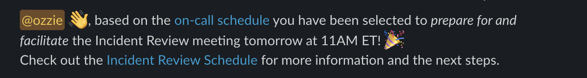

## Proposal

Incident review meeting is prepared for and facilitated by an on-call engineer.

## Reasoning

The Incident review meeting is an important part of the incident follow-up process. It is an opportunity to reflect on the incident, learn from it, share knowledge and experience with others. #product-velocity wants to make the process more _inclusive_ and more _transparent_. The goal is to make the incident review process _simple_ and _easily repeatable_, so that any engineer can facilitate the meeting, like we do with open-standup.

Additionally, involving engineers in the process of incident review facilitation would help to reinforce some of the steps of handling and resolving incidents.

## Exceptions

There are a number of exceptions that need to be considered. Some of the most obvious exceptions are:
- An incident occurs during the time of the meeting
- On-call schedule changes (selected engineer is not available)
- Meeting is postponed or cancelled
- Etc...

While we won't be able to cover all possible exceptions initially, we can cover the most common ones to start and iterate on the process as we go.

  
Exception examples in more detail

### When there is no incident to review?

- If there is no incident to review, the meeting can be cancelled.

### Engineer is suddenly not available to facilitate the meeting, in the event of a sudden incident?

- The speaker can take over the facilitation of the meeting and catch up with the on-call engineer later.

### Engineer is on-call for two weeks in a row?

- This is rare but it happens (e.g. engineering manager). The engineer can keep the responsibility or delegate the preparation and/or facilitation to another engineer.

### The selected engineer asked for cover on the day of the meeting (scheduled override)?

- Engineer can delegate the facilitation to the other on-call engineer or whomever is covering the shift (override) on the day of the meeting.

### What to do when the speaker is not available.

- The meeting can be postponed or swapped with another meeting.

### What to do when multiple incidents occur during the same week and there are already pending reviews?

- Sometimes we have to schedule a catch-up meeting to review one or even multiple incidents in order to clear up the schedule and reduce the lead time between incident and review. This requires coordination and management of the schedule. If there are more than two pending reviews on the schedule, a catch-up meeting should be scheduled by the next on-call engineer who is selected to facilitate.

## Additional Context

The process is largely the same as it currently stands with the following changes:

- One on-call engineer is selected (randomly) to prepare for and facilitate the meeting
- A more [streamlined playbook](https://www.notion.so/artsy/Incident-Review-Facilitation-Template-on-call-edition-195fbb6853ff423197a2ed9dd72fee45)🔒 (on-call edition) is used
- The playbook is [embedded](https://artsy.slack.com/archives/CE6URL06M/p1677690883019989?thread_ts=1677690844.434719&cid=CE6URL06M)🔒 into each row of the [Incident Review Schedule](https://www.notion.so/artsy/Incident-Reviews-725052225efc49e78532b13e166ba3c7)🔒
- A reminder is posted in #dev channel instead of #product-velocity
  - 
- Incident review schedule check is performed during open-standup

  
Detailed context

### How does the Incident Review process work now?

When incidents occur, [resolve step #5](https://github.com/artsy/README/blob/main/playbooks/incident-handling.md#4-resolve) asks the responder to update the [Incident Review Schedule](https://www.notion.so/artsy/Incident-Reviews-725052225efc49e78532b13e166ba3c7)🔒 with the details of the incident, relevant dates and the speaker. The speaker is the engineer most familiar with the resolution and the one who will be presenting the postmortem.

Every other Wednesday at 10AM ET a reminder is posted in #product-velocity channel to check the schedule. This process is backed by a [Incident Review Playbook](https://www.notion.so/artsy/Incident-Review-Facilitation-a1355615adc24026a5ddc49fff2b6761)🔒.

The preparation and facilitation is performed by one of #product-velocity members:

  
Steps in a nutshell

- Check the schedule the day before the meeting
  - Follow-up to ensure speaker will be available
  - Reschedule when necessary (speaker is not available)
  - Cancel when necessary (no incidents to review)
- Facilitate the meeting by following the playbook
  - Move the discussion forward
  - Aim to perform 5 whys analysis
  - Ask some questions to get a sense of response performance
  - Keep track of action items (speaker does this too and notes them in the postmortem)
- Close out the review with follow-up steps

### How will the on-call engineer be selected for facilitation?

A slack bot will post a reminder to the #dev channel the day before the meeting. The bot will perform a random selection out of the two on-call engineers and post the name of the selected engineer along with a link to the schedule where they can find the playbook.

### Time commitment

Expected time commitment is up to ~1.5 hours per (on-call) week. 30m prep, 30m meeting, 30m followup. Based on the current number of engineers and the structure of on-call schedule, most engineers participate in ~2 on-call shifts per year. This means the time commitment per year would be ~3h, if the engineer is selected to facilitate each time they are on-call.

> Time commitment could be reduced (~30m) by automating parts of the preparation the day before the meeting, leaving the facilitation (and follow-ups) to be the only time commitment.

## How is this RFC resolved?

1. Collect feedback and amend the process as necessary.
1. The [Incident Review Playbook (on-call edition)](https://www.notion.so/artsy/Incident-Review-Facilitation-Template-on-call-edition-195fbb6853ff423197a2ed9dd72fee45)🔒 replaces the current [Incident Review Playbook](https://www.notion.so/artsy/Incident-Review-Facilitation-a1355615adc24026a5ddc49fff2b6761)🔒.
1. Update the [Incident Review Schedule](https://www.notion.so/artsy/Incident-Reviews-725052225efc49e78532b13e166ba3c7)🔒 to include the playbook within first cell of each new row and add tips on how to get started.
1. Open-standup playbook is updated to include a link to the [Incident Review Schedule](https://www.notion.so/artsy/Incident-Reviews-725052225efc49e78532b13e166ba3c7)🔒 and a bullet asking the standup facilitator to check the schedule for pending reviews as well as to announce the speaker.
1. A slack bot is scheduled to post a reminder to the #dev channel the day before the meeting.

<!--
Things to do after you create the RFC:

- Publicise it. Post it on the different slack dev channels, talk about it in meetings, etc.
- Wait for some time to make sure as many people as possible have seen it and collect feedback
- Although encouraged, not everyone has to interact. A lack of response is assumed to be positive indifference.

Once the RFC is ready to be resolved, feel free to copy the resolution template that can be found here: https://github.com/artsy/README/blob/43c400d81ff9fee7276c3dd934de26b985da362f/playbooks/rfcs.md#resolution

You can now populate the template and post this as the last comment, if you want also post it on the bottom of RFC description, and finally close the issue.
-->

