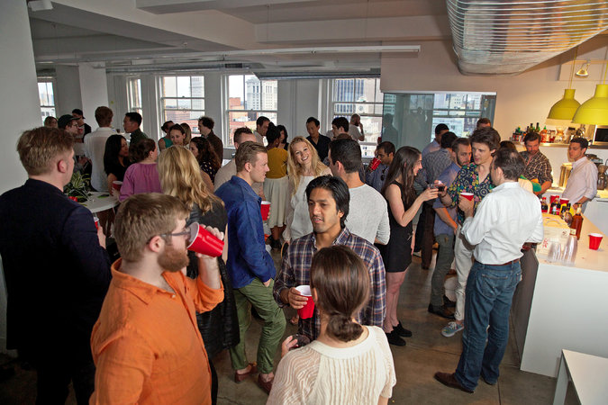

# Happy Hours at Artsy

Happy Hours are a long-standing event at Artsy where employees get together and invite our partners, family, friends,
artists and fellow engineers. It was inspired by the happy hour at Artsy's first office in the co-working space of
General Assembly in 2010 and remained a tradition ever since.

We run happy hours once a month on the first Friday of every month except in the summer, when it is a Thursday.

Happy Hour is held inside our offices, on a weekly basis. We strive to make them full of interesting people across the
tech & arts spectrum. Other than friends we tend to invite great candidates that we might not be currently interviewing, but
maybe will consider in the future, or that we believe could use some help networking with fellow engineers.

There are small snacks, drinks (including beer, wine, whiskey, etc.). We have a bartender.

The best way to get invited is to engage with one of our team members through open-source work or social media.

If you have been invited, welcome!

## Location

## TLDR

- Typically Fridays 6-8:30pm
- Thursday in summer
- 401 Broadway, closest to Canal Street station, 24th Floor
- Arrive early, doors close to new people at around 8
- E-mail full names of yourself and everyone you're bringing to your Artsy contact at least 24 hours prior, and make sure they have confirmed - if your name is not on the guest list you will be turned away
- You must bring a valid ID
- Kids are OK, no dogs allowed
- Have a good time, make new friends

## When Inviting Someone as Artsy Staff

Add your guests' name(s) to the
[happy hour guest list 🔑](https://docs.google.com/spreadsheets/d/1mNpXhJq4sNGtyCRcVN0nEFWuw7Y3jtX7O9O4M0R6WOY/edit#gid=1283496295).
There's a tab for every date, make sure you're adding them to the right one!

If you need a flyer, download and edit one [here 🔑](https://sites.google.com/a/artsymail.com/intranet/experience/internal-events/happy-hour-invite). Or use the following text.

### Winter

> Come visit us at the Artsy Happy Hour! It's every Friday (and last Thursday of every month),
> 401 Broadway, 24th Floor @ Canal St., 6-8pm. E-mail me the day before to get on the building security list.
> Bring whomever you want!

### Summer

> Come visit us at the Artsy Happy Hour! During summer it's every Thursday, 401 Broadway, 24th Floor @ Canal St.,
> 6-8pm. E-mail me the day before to get on the building security list. Bring whomever you want!
