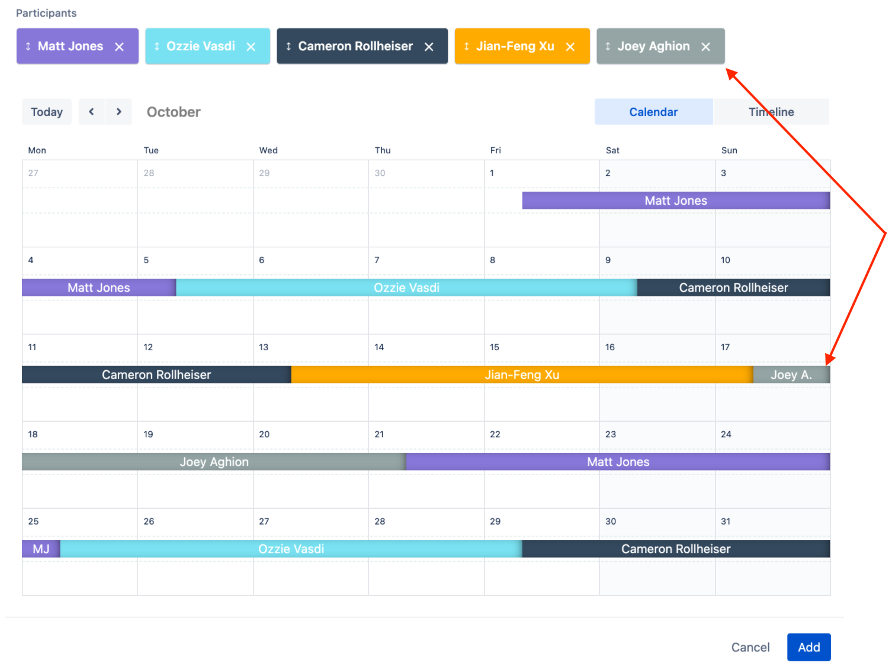
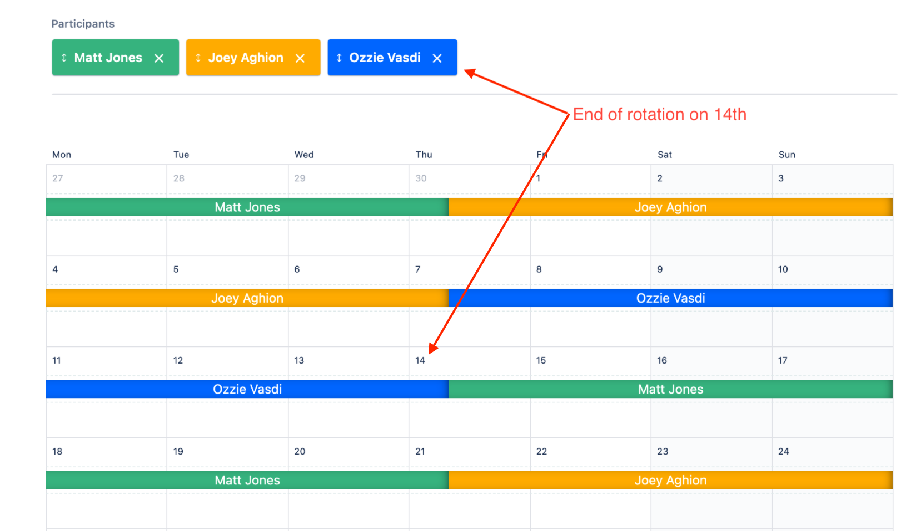
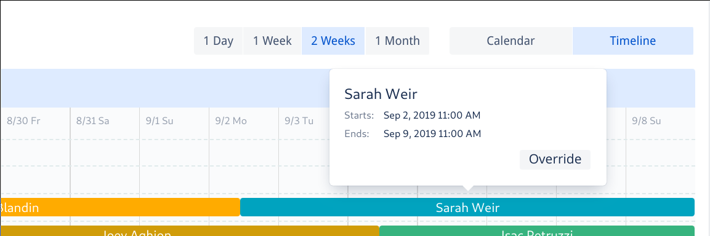
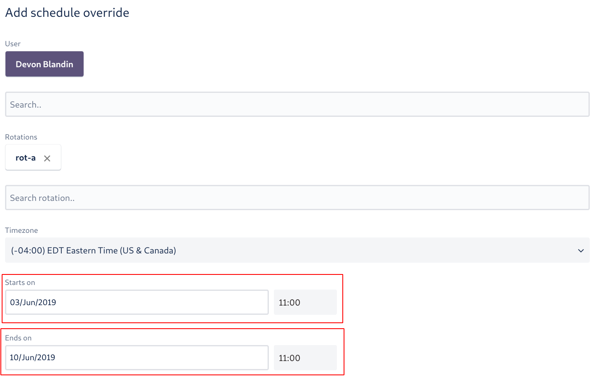
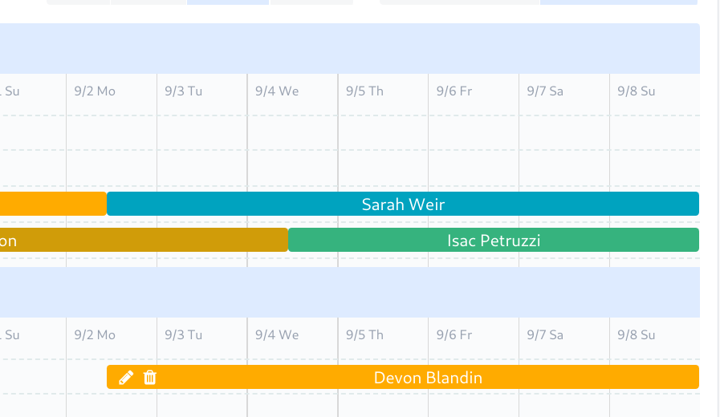
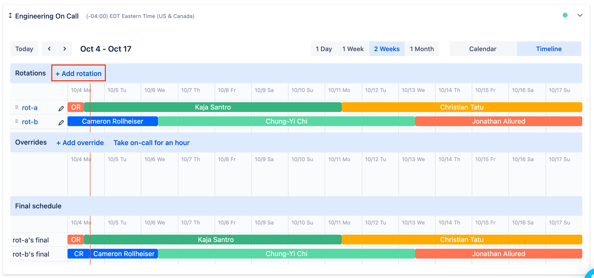
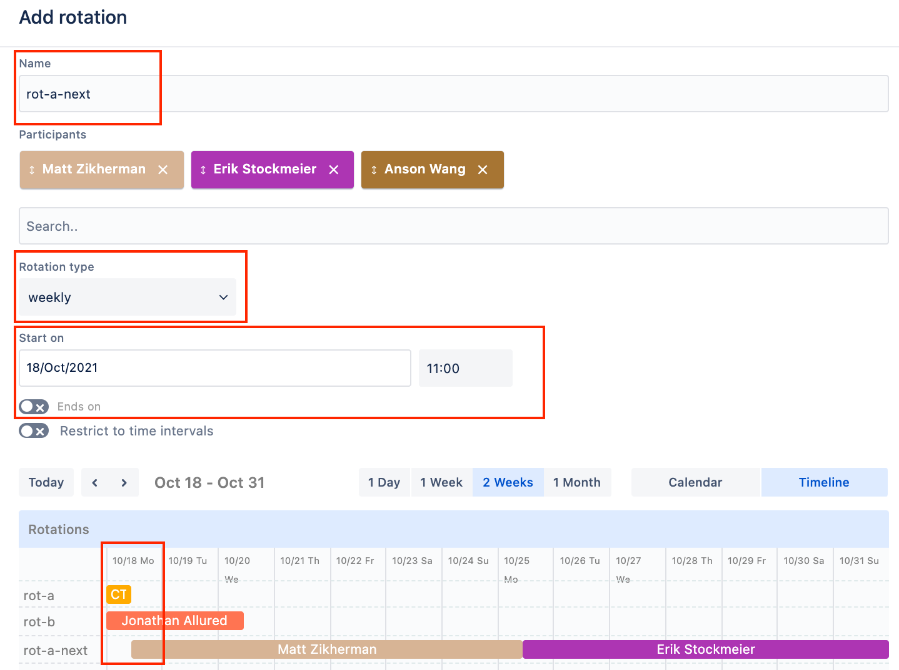
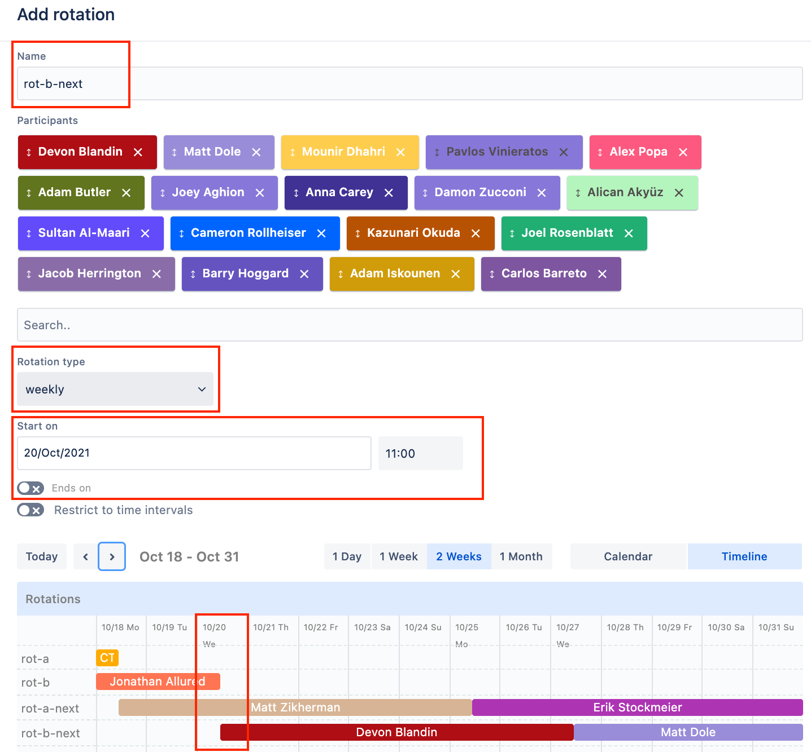
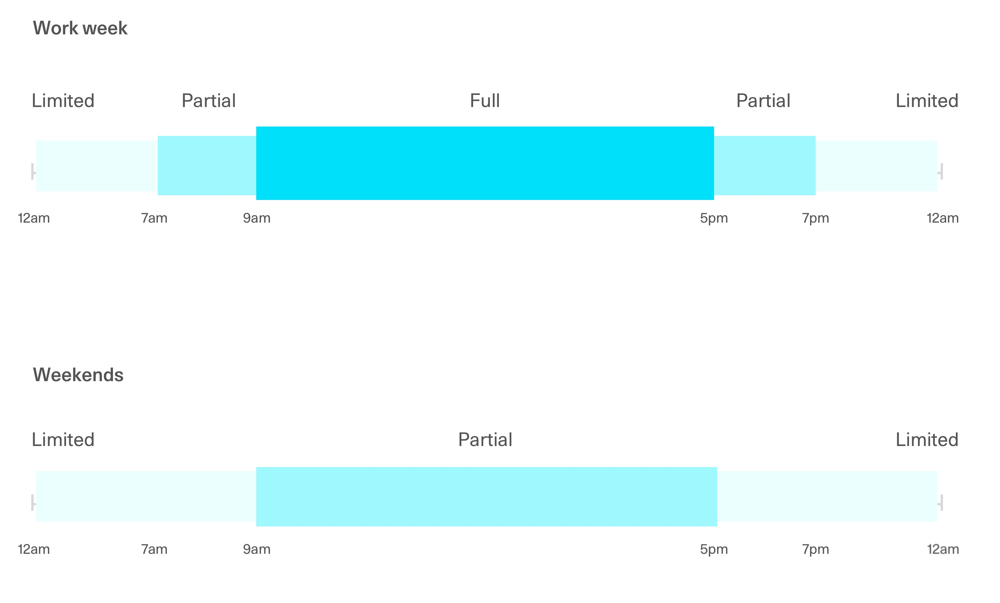
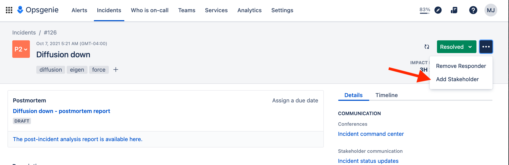

# Incident Handling

This document describes how we provide **urgent engineering support**. We consider disruptions "incidents" when
they affect **a significant proportion of users, critical business functions, or sensitive data**. Less urgent bugs
and requests should be prioritized and addressed by associated product teams within the course of their usual work.

### On-call rotations

To ensure redundancy, 2 engineers are on-call at a time. Shifts last 1 week and start on either Monday or
Wednesday, for continuity of coverage. See the
[Opsgenie on-call schedule](https://artsy.app.opsgenie.com/teams/dashboard/ee381004-a72e-42ef-a733-b350d6693c6c/main)🔒
for details.

<details>
  <summary>Adding engineers to the schedule</summary>

1. If the engineer doesn't have an Opsgenie account already, create one for them in the Settings -> Users page
   (give them the role of 'Responder'). Then
   [add them](https://support.atlassian.com/opsgenie/docs/create-a-team-and-add-members/) to the Engineering team
   in the Engineering members page by going to Teams -> Engineering -> Members (give them the role of 'User').

- If we have hit our user limit, ask the #on-call-working-group to add an additional license. A user with the role
  of "Owner" can add a license by going to Settings > Subscriptions, clicking "Update Jira Ops Plan," and
  increasing the user count by 1.

2. Navigate to the
   [On-Call Schedule](https://artsy.app.opsgenie.com/teams/dashboard/ee381004-a72e-42ef-a733-b350d6693c6c/main)🔒.

3. Add a new engineer to a rotation: </br>

   a. If there are `no-one` placeholders in a rotation, swap them with the first `no-one` placeholder that's
   **greater than 60 days away** from the new engineer's start date.</br>

   

   b. If there are no `no-one` placeholders, add the new engineer to the end of the current rotation, **if greater
   than 60 days away from their start date**, by placing them last in the participants list.

    </br>

   You can identify when the rotation ends by checking the end date of the last participant's next rotation. For
   example:

   

   c. If a new engineer's start date is within 60 days of the current rotation end date, then you should delay
   adding them until the new rotation has started.

   - We recommend setting a
     [Slack reminder](https://slack.com/blog/productivity/never-forget-the-little-things-with-remind) or calendar
     event for yourself. In Slack you can:

     > /remind me to add @new-engineer to on-call rotations in 60 days

Considerations when adding a new engineer:

- Avoid pairings of two new engineers. Place the new engineer earlier in the rotation to avoid this.

- If for some reason you need to add a new engineer anywhere other than (a) where there was a `no-one` placeholder
  or (b) the end of a rotation, the upcoming schedule of shifts will be modified, as the order of the participants
  matters. **You should notify the affected engineers to avoid scheduling conflicts.** E.g.:

  > Hi @impacted-engineer! We've added a new engineer to the on-call schedule which has modified the dates of your
  > on-call shift. Please take some time to review the schedule and trade shifts as needed.

- Alternatively, to minimize shifting multiple engineers' schedules, it may be preferable to reach out to one
  engineer directly and ask them to switch shifts. E.g.:

  > Hi @engineer! We've added a @new-engineer to the schedule and would like to support them by not pairing them
  > with another new engineer for their first on-call shift. Would you be able to switch shifts with them? The new
  > dates of your on-call shift would be X to Y.

- Check for an unbalanced number of rotation participants in rot-a vs rot-b. If staff locations result in one
  rotation having significantly fewer engineers, you should prioritize a balanced rotation schedule over Eastern
  Time Zone coverage.

</details>

<details>
  <summary>Removing engineers from the schedule</summary>

When an engineer leaves:

- They will be replaced with a `no-one` placeholder in the schedule as part of the
  [off-boarding checklist](https://docs.google.com/document/d/10mmqkXnYVp0ZOmF5JwVPyxkzcyIN-rqO8prHgIi11lw/edit)🔒.
- Their manager will be asked to override that shift with themselves.
- Their Opsgenie user account will be deleted.
  </details>

<details>
  <summary>Trading or overriding shifts</summary>

To switch shifts you may schedule an override in OpsGenie. To override a shift:

1. Navigate to
   [Engineering On-Call Schedule](https://artsy.app.opsgenie.com/settings/schedule/detail/aa7d47fa-ab67-4c09-b9ca-d43a20efbb04)🔒

1. Find and hover over the shift and click override:


    

1. You may want to update the default configuration:

- By default, you will take the shift. If you'd like to assign someone else, search for and assign them
- By default, you will override the entire shift. If you'd like to partially override the shift, adjust the
  Starts/End on dates

   

1. Click "Add" and verify your override:

      
   </details>

<details>
  <summary>Special holiday shifts</summary>

Holiday on-call shifts take place from 2-3 days before December 25th to 2-3 days after January 1st. These holiday
rotations are labeled `Holiday-a` and `Holiday-b`. During this time, on-call shifts will be on a volunteer basis
and rotate every two days.

To volunteer for a holiday shift:

1. Navigate to
   [Engineering On-Call Schedule](https://artsy.app.opsgenie.com/settings/schedule/detail/aa7d47fa-ab67-4c09-b9ca-d43a20efbb04)
2. Browse any of the available holiday rotations

  

3. Refer to _Trading or Overriding_ (above) to assign yourself a shift.
   </details>

<details>
  <summary>Creating a new on-call schedule</summary>

We use a staggered schedule to retain context and limit disruption as engineers shift in/out of rotation. "A"
rotations start/end on a Monday at 11am ET. "B" rotations start/end on a Wednesday at 11am ET. Each engineer will
be on-call once per rotation.

1. Generate a list of current engineers. This should include everyone who started before the next round is supposed
   to begin (you can use [Bamboo](https://artsy.bamboohr.com/anytime/directory.php)🔒 as a reference). Bonus points
   for using [artsy-cli](https://github.com/artsy/artsy-cli):

   ```
   $ artsy on-call:list --team=Engineering --randomize --split=2
   ```

2. Split engineers into A and B groups. Group B should include all engineers located outside of the US Eastern Time
   zone. This ensures that we always have one engineer on-call during Eastern working hours.

3. Identify any exceptions/special cases and address them. These may include:

- People who have very recently started (as a courtesy, you should schedule them towards the end of the round)
- An unbalanced number of rotation participants. If staff locations result in one rotation having significantly
  fewer engineers, you should prioritize a balanced rotation schedule over Eastern Time Zone coverage.

4. Create a new A rotation:

- Name the new rotation "rot-a-next"
- Add all participants from group A into the A rotation
- Set the rotation type to "weekly"
- Set the "Start on" date to correspond with the "End on" date from the previous A rotation
- Leave "Ends on" unselected to ensure rotations repeat indefinitly

  
  

5. Create a new B rotation:

- Name the new rotation "rot-b-next"
- Add all participants from group B into the rotation
- Set the rotation type to "weekly"
- Set the "Start on" date to correspond with the "End on" date from the previous B rotation
- Leave "Ends on" unselected to ensure rotations repeat indefinitely

  

6. Put a note in the #dev channel announcing that the new rotations are up. This may look something like this:
   > @developers Hello team! :wave:
   >
   > The upcoming Engineering On-Call rotations are up on OpsGenie. Please take some time to review the schedule
   > and trade shifts as needed.

</details>

## Before an on-call shift

### Resolve conflicts

If you're unavailable for any part of an on-call shift, ensure that your on-call partner is available. If you have
a significant conflict, swapping days (or multiple days or even entire shifts) with other engineers is encouraged.
See _Trading or Overriding_ above.

### Set up the Opsgenie app

- Ensure the OpsGenie app (for [iPhone](http://itunes.apple.com/us/app/opsgenie/id528590328?mt=8) or
  [Android](https://play.google.com/store/apps/details?id=com.ifountain.opsgenie&hl=en)) is installed and logged
  in.
- Double check your preferences for push notifications, text messages, and/or phone calls for alerting in your
  [OpsGenie user notification settings](https://artsy.app.opsgenie.com/settings/user/notification).

### Enable Slack notifications

Potential incidents are usually raised as threads in [#incidents](https://artsy.slack.com/archives/incidents)🔒.
Additionally, automated alerts notify the [#alerts](https://artsy.slack.com/archives/alerts)🔒 channel. Both are
worth monitoring during on-call shifts.

#### On the [mac] desktop

- Open the [#incidents](https://artsy.slack.com/archives/incidents)🔒 or
  [#alerts](https://artsy.slack.com/archives/alerts)🔒 channel and click the channel name to access channel
  settings
- Click the star to add the channel to your starred group
- In the notifications drop-down, select _Get notifications for all messages_

#### On your mobile device

- Make sure "do not disturb" is turned off on the device itself (i.e., no red is visible on an iPhone's silence
  switch)
- In the slack app, click the channel name to access channel settings
- Click the _Notifications_ option and select _Every new message_

## During your rotation

### Update the #incidents channel's topic with who is on call

- Click the [#incidents](https://artsy.slack.com/archives/incidents)🔒 channel's name
- Click _Edit_ on the channel's topic
- Update the topic with the with the new on-call engineers' names (that's you!)

_Tip: use the `/genie whoisoncall` Slack command to find out who is on call at any time._

### 1. Monitor

During an on-call shift, engineers are expected to monitor the [relevant channels](#enable-slack-notifications),
acknowledge alerts, and respond to incident reporters in a timely and responsible way.

#### Service-Level Objective

We target the following [service-level](https://landing.google.com/sre/sre-book/chapters/service-level-objectives/)
for incident handling response times:

- **10 minutes** ("full support") during local business hours (9am-5pm)
- **30 minutes** ("partial support") during local waking hours outside of business hours (7am-7pm on work days, or
  9am-5pm on non-work days)
- **no guaranteed response time** ("limited support") beyond those hours



This objective only relates to the time between an incident being reported and the on-call engineers' initial
acknowledgement (and tracking in Opsgenie). We don't guarantee recovery times, though obviously those are of great
interest to us.

#### Monitoring automated alerts

The [#alerts](https://artsy.slack.com/archives/alerts) channel receives automated notifications from various
sources (Datadog, Pingdom, Sentry). It aims to be quiet and restricted to actionable events, but your judgment is
required to assess their severity.

<details>
  <summary>Examples:</summary>

- **Service unavailable:** definitely an incident if affecting critical services such as www.artsy.net (Force) or
  api.artsy.net (Gravity)
- **Warnings about moderately high response time or job latency**: may resolve automatically as deployments scale
  up, so monitor
- **High latency, error rate, or timeouts:** probably an incident unless very brief or limited to a non-critical
  service
- **Services repeatedly flapping between available and unavailable states:** worth investigation and possibly
  raising as an incident, since this is (or should be) unusual
  </details>

When in doubt, ask for help from
[the associated team or point person](https://www.notion.so/artsy/17c4b550458a4cb8bcbf1b68060d63e6?v=2b874803f96c483bbdc2e80b7fbd25f9)🔒
to assess alerts.

If an alert is consistently noisy and not actionable, consider "muting" the Datadog monitor and raising to the
associated team for follow-up.

#### Responding to other incidents

If an urgent issue is raised directly in the [#incidents](https://artsy.slack.com/archives/alerts) channel, its
severity should be assessed, as above. If the issue clearly does not **affect a significant proportion of users,
critical business functions, or sensitive data**, it should be triaged by
[the responsible team](https://www.notion.so/artsy/Product-Teams-Scope-Ticket-creation-a4d8357954764f2cb34b4eb9d1cb6763)🔒
rather than invoking further support.

If a problem surfaces elsewhere (in Slack, e-mail, etc.), or an automated alert is deemed incident-worthy, start a
new #incidents thread for others' visibility. This is where other stakeholders can follow updates.

Many people follow the #incidents channel closely, so avoid noise by keeping discussion to a single thread.

<details>
  <summary>Examples of worthy incident reports:</summary>

- a business-critical feature (such as authentication, search, inquiry, bidding, or payment) is disrupted
- simultaneous support requests from users or partners indicating a pattern
- time-sensitive disruptions, such as preventing an auction from opening or closing
  </details>

Issues not observably effecting production, but resulting in major workflow disruptions, should also be treated as incidents. When communicating a non-production incident, it should be made clear that there is no preceived impact on production to avoid creating confusion for the team members following the incident. These types of incidents should be marked as "low" (P4) or "informational" (P5) in OpsGenie.

### 2. Raise

1. **Track the incident** by creating an incident in [OpsGenie](https://artsy.app.opsgenie.com/incident/list) based
   on the available information
   
> After you submit the incident, another onCall engineer will be notified via an alert from OpsGenie
> 
> Add responders immediately if the failure requires attention urgently and you cannot handle it yourself, the responder will be notified via an alert from OpsGenie as well

- Select _Artsy_ as the impacted service.
- Enter a short description and link to the #incidents thread in the summary field.
- Use your judgment to select a suitable _Priority_ level, based on the incident's severity.
  <!-- TODO: define how to apply priority levels more consistently -->
- Take your best guess at the other information; it can always be edited later.

2. **Create a Slack channel** dedicated to the incident's technical resolution

- Follow the **Create Slack channel** link from the OpsGenie incident page and create a `#inc-*` channel named with
  the incident's number.
- Invite the other on-call engineer and any other active responders to the new channel.
- In the original #incidents thread, share a link to the new #inc-\* channel and _direct any further technical
  discussion there_.

3. If the incident affects a critical public function (e.g. search) or a broad category of users (e.g., all
   partners), **update the [Artsy status page](https://status.artsy.net)** via the
   [StatusPage.io](https://manage.statuspage.io/pages/hmhlbjlmdhgh/incidents) account (details in 1Password). The
   update should _briefly_ acknowledge the issue, focusing on public impact
   ([examples](https://twitter.com/stripestatus)). Technical details or system code names are not relevant or
   appropriate.

### 3. Address

#### Roles

The first on-call engineer on the scene should
[take the role of **Incident Commander**](<(https://support.atlassian.com/opsgenie/docs/define-incident-response-roles/)>) unless
there's another volunteer or naturally responsible candidate. Your responsibility in this role is to _facilitate_ a
successful resolution, not to solve the problem yourself.

If both on-call engineers are available, the 2nd should take the role of **Communications Officer**, handling
updates to internal stakeholders (on the #incidents thread) and external audiences (on the status page), as well as
recording relevant information (insights, links...) on the incident timeline. If both engineers aren't available,
the incident commander can perform both roles or ask for another volunteer.

#### Diagnose

Discuss the incident's resolution in the dedicated Slack channel. Tips:

- Scan [recent releases](https://github.com/pulls?q=is%3Amerged+is%3Apr+archived%3Afalse+org%3Aartsy+deploy). If
  the timing or changes indicate that a particular release is responsible,
  [rolling it back](https://github.com/artsy/hokusai/blob/master/docs/Command_Reference.md#how-to-do-a-rollback) is
  often the simplest and fastest solution. Follow up by reverting the relevant pull request, so the main branch and
  staging environment are once again healthy and deploys are unblocked while a more complete fix is implemented.
- Start a video conference to communicate in real-time with other responders (see 1Password for shared Zoom account
  credentials).
- See
  [Engineering Playbooks (Notion)](https://www.notion.so/artsy/Engineering-Playbooks-b655fe54c1ce4b35af342c9ed9a489ae)🔒
  and [legacy wiki docs](https://github.com/artsy/potential/wiki)🔒 for solutions to common problems.
- Datadog [monitors](https://app.datadoghq.com/monitors/triggered?q=),
  [service traces](https://app.datadoghq.com/apm/services), and
  [dashboards](https://app.datadoghq.com/dashboard/lists) can illuminate the source and scale of latency or errors.
- Error details are [captured in Sentry](https://sentry.io/organizations/artsynet/issues).
- Logs are searchable [in Papertrail](https://papertrailapp.com/dashboard).
- The [Kubernetes dashboard](https://kubernetes.prd.artsy.systems/) reflects the configuration, scale, or events
  relating to specific system deployments.
- See also other metrics and dashboards (AWS, MongoDB, Elasticsearch/kibana, Sendgrid, Cloudflare...).

If a mitigation (such as rolling back a release) requires some follow-up, make sure to note it on the incident and
surface to the appropriate team. If a mitigation isn't immediately apparent, **escalate to an appropriate team or
engineer**.

#### Escalate

When investigating an incident, you should involve the relevant team and stakeholders involved as soon as possible.
**You are not expected to know the ins and outs of every system, so don't hesitate to involve the wider team.**

<details>
  <summary>To escalate an issue:</summary>

- Identify the engineer responsible for the associated pull request or release. If not obvious, the
  [relevant team](https://www.notion.so/artsy/Product-Teams-Scope-Ticket-creation-a4d8357954764f2cb34b4eb9d1cb6763)
  can suggest a familiar engineer. Absent that, the
  [affected system's local point person](https://www.notion.so/artsy/17c4b550458a4cb8bcbf1b68060d63e6?v=3604e2682d024b64bde705abb2facebd)
  may be a good choice and can help investigate further.
- [Add the responder](https://support.atlassian.com/opsgenie/docs/add-or-remove-a-responder/) to the incident as a
  [Subject Matter Expert](https://support.atlassian.com/opsgenie/docs/define-incident-response-roles/). (This can
  also be done directly from the OpsGenie-created Slack channel.) Adding the responder will notify them and keep
  them alerted to ongoing developments.

- Add the PM as a stakeholder to the issue. This will notify the stakeholder via email and allow them to receive
  updates on the ongoing progress of the incident.

  

- Alert the relevant team via slack in the #inc-\* slack channel you created for the incident and share any
  applicable work-arounds or talking points in the thread to unblock teammates or partners.
  </details>

#### Communicate

The Communications Officer is responsible for updates across several locations:

Incident updates, discoveries, or milestones (e.g. changes in availability or resolution) should be recorded in
**the OpsGenie timeline**. This timeline will be referenced later while reviewing the incident
([e.g.](https://artsy.app.opsgenie.com/reports/post-mortem/b5710803-4bcb-4f0b-a906-4a2343521328/detail)), so it's
helpful to have as much information captured as possible. Entries can even be added after-the-fact with a past
timestamp.

Internal stakeholders should be updated about any status changes or work-arounds in **the original #incidents
thread**.

As the incident changes state from being investigated to mitigated to hopefully resolved, update **the StatusPage
entry** accordingly. If an incident is especially lengthy, consider updating the entry periodically to reaffirm its
status. (But not too often: customers may be subscribed to receive each of these updates by email.)

If at any point the severity of problem is better understood to be non-urgent, _resolve_ the incident and direct
stakeholders to
[the relevant team for further follow-up](https://www.notion.so/artsy/Guide-to-reporting-bugs-cc25e1ff41194228b476c4963c646817) 🔒.

### 4. Resolve

Incidents are considered resolved when the immediate issue has been mitigated. Follow-up items should be tracked
and linked to the corresponding OpsGenie incident.

1. If follow-up tasks are apparent, create tickets in the relevant team's backlog. Link to these from the OpsGenie
   incident and surface them to the impacted team.
2. Post any final updates to the OpsGenie incident and #incidents thread

   - Add a timeline entry describing why you're resolving the incident
   - Mark the incident as **RESOLVED**
   - Close relevant [alerts](https://artsy.app.opsgenie.com/alert/list) 🔒

3. If applicable, resolve the incident on our status page.

   If you've been responding to an incident outside of usual working hours, you're encouraged to reclaim that time
from your work week.

4. Draft the postmortem in Opsgenie

   - If outstanding questions or opportunities need further consideration, this is a good place to note them for
     discussion in the incident review meeting.
   - Aim to fill out the postmortem template within ~2 days.
   - Once the basics are reflected in the postmortem, invite input on the draft from other on-call engineers or
     subject matter experts.

5. Schedule an _Incident Review_ by adding a new row to the [Incident Review Schedule](https://www.notion.so/artsy/Incident-Reviews-725052225efc49e78532b13e166ba3c7)🔒
  
    Fill out the required details:

    - The Opsgenie incident number
    - A link the postmortem
    - Set the date of the incident and the date the incident will be reviewed on
    - A brief summary
    - One or more responders as speakers

  > The postmortem should remain in 'Draft' state until the review session.

6. Update relevant [playbooks](https://www.notion.so/Engineering-Playbooks-b655fe54c1ce4b35af342c9ed9a489ae)🔒 with
   any procedures or scripts that were useful in mitigating the incident.

## After your rotation

Congratulations--you've completed your on-call shift!

If an incident is ongoing at the end of your shift, help **onboard** the new on-call engineer to your role
(commander or communications officer) and any ongoing monitoring or tasks.

Incorporate any feedback into postmortems and ensure you attend the bi-weekly
[incident review meeting](https://www.notion.so/artsy/Incident-Reviews-725052225efc49e78532b13e166ba3c7)🔒 where
they'll be discussed. These meetings are a chance to critically [but
[blamelessly](https://www.atlassian.com/incident-management/postmortem/blameless)] evaluate how an incident could
have been prevented, mitigated more quickly, or its business impact reduced. If new to incident reviews, you might
be interested in [these best practices](https://newsletter.pragmaticengineer.com/p/incident-review-best-practices).
