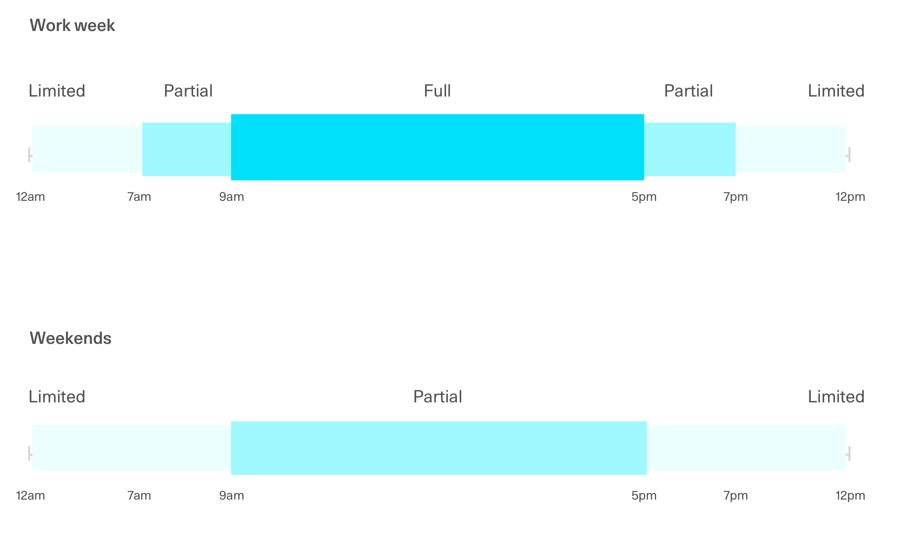

# On-Call SLO

This document describes a
["Service-Level Objective"](https://landing.google.com/sre/sre-book/chapters/service-level-objectives/) for our
on-call response time to incidents.

## What we promise

- Incidents should have a response time of under 10 minutes during hours of **full support**.
- Incidents should have a response time of under 30 minutes during hours of **partial support**.

- Work days (excludes
  [holidays](https://docs.google.com/document/d/16FQ0nKIJ_Eb11kWQd70neB7V3i51ixUsf-CB5f_rAMo/edit#heading=h.d93f947ory))
  - 9am — 5pm ET full support
  - 7am — 7pm ET partial support
  - 7pm — 7am ET no official support
- Non-work days
  - 9am — 5pm ET partial support

### Measuring performance against this SLO

This SLO targets the time between when an incident is first reported in #incidents and a Jira Ops ticket is
created.

### Live Auctions

There is currently no explicit support for live auctions outside of the on-call schedule defined above. For special
cases where an auction must be monitored during hours not covered above, the relevant product teams should be
directly consulted.
