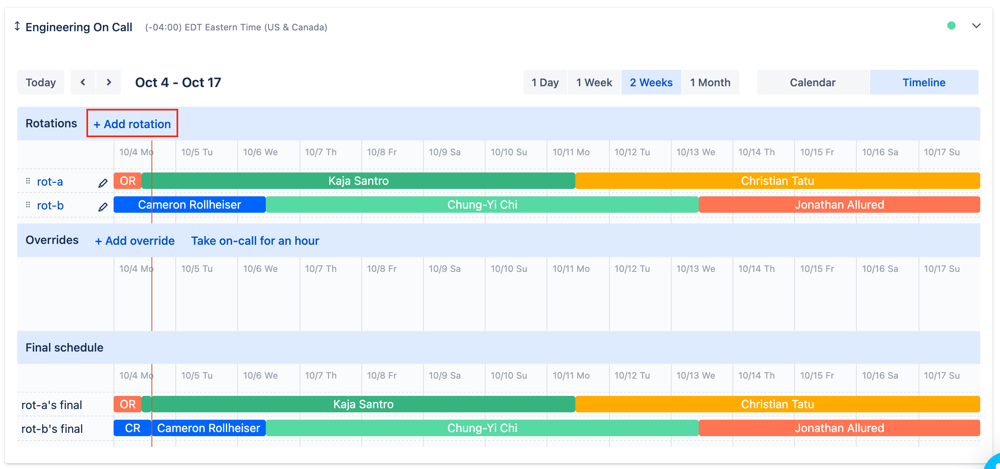
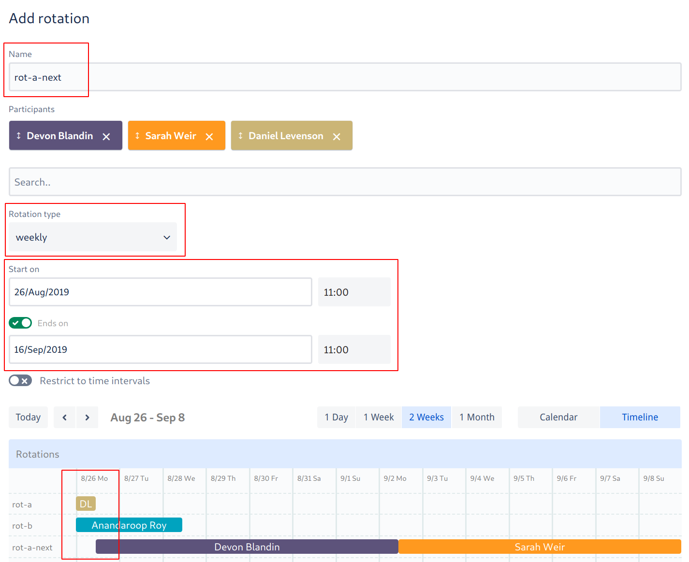
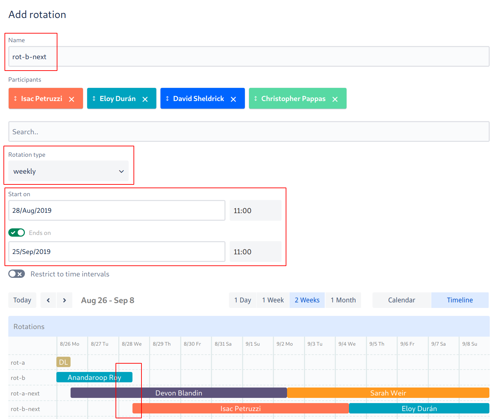
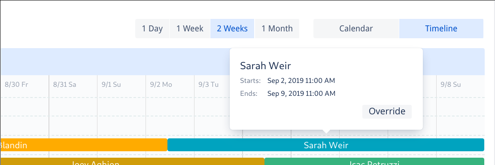
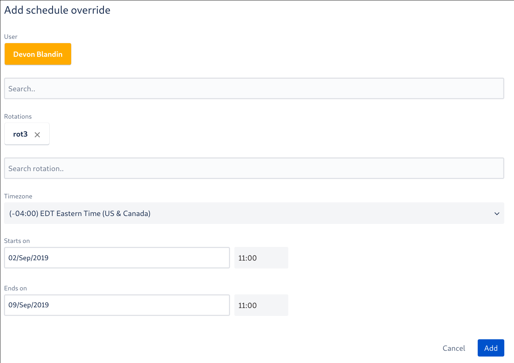
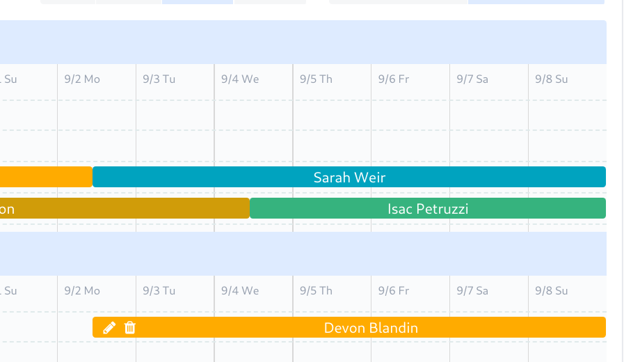

# Scheduling

The [Engineering On-Call schedule][schedule] is configured in OpsGenie. Trading shifts (because of vacations,
obligations, etc.) is encouraged as long as the schedule is kept up-to-date. Please address any scheduling issues
as early as possible.

A month before the next round of on-call is slated to begin (can check when the current round ends to verify this
timeline), we being scheduling the next round.

## Steps for Scheduling On-Call

We use a staggered schedule to retain context and limit disruption as engineers shift in/out of rotation. "A"
rotations start/end on a Monday at 11am. "B" rotations start/end on a Wednesday at 11am.

1. Generate a list of current engineers. This should include everyone who started before the next round is supposed
   to begin (can use [Team Navigator][] as a reference)

1. Split engineers into A and B groups. Group B should include all engineers located outside of the Eastern Time
   zone. This ensures that we always have one engineer on-call during Eastern working hours.

1. Identify any exceptions/special cases and address them. These may include:

   - People who doubled-up the last round (should be left out of this round)
   - People who have very recently started (as a courtesy, you should schedule them towards the end of the round)

1. Create a new A rotation:

   - Name the new rotation "rot-a-next"
   - Add all participants from group A into the A rotation
   - Set the rotation type to "weekly"
   - Set the "Start on" date to correspond with the "End on" date from the previous A rotation
   - Set the "Ends on" date far out enough so that every participant has one shift

   
   

1. Create a new B rotation:

   - Name the new rotation "rot-b-next"
   - Add all participants from group B into the rotation
   - Set the rotation type to "weekly"
   - Set the "Start on" date to correspond with the "End on" date from the previous B rotation
   - Set the "Ends on" date far out enough so that every participant has one shift

  
 
1. Sanity check shifts against OOO calendar - the best way to do this is to have the rotations one on side of your screen and the OOO calendar on the other and then just page through them and look for conflicts. This won't stave off all conflicts, but ensures we're not causing any unnecessary ones.

1. Put a note in the #dev channel announcing that the new rotations are up. This may look something like:

   > @developers Hello team! :wave:
   >
   > The upcoming Engineering On-Call rotations are up on OpsGenie. Please take some time to review the schedule
   > and trade shifts as needed.

1. Schedule a reminder in Slack to remove the previous rotations and remove -next rotation name suffixes.

   > /remind #on-call-working-group to remove/rename rotations on BLAH

1. Schedule a reminder in Slack to repeat this process for the next round about a month before the next round is
   schedule to end.
   
   > /remind #on-call-working-group to schedule the next round of rotations on BLAH

[team navigator]: https://team.artsy.net

## Holiday Scheduling

Holiday on-call shifts will take place from December 21st to Janurary 6th, these holiday rotations are labeled `Holiday-a` and `Holiday-b`.
During this time, on-call shifts will be on a volunteer basis and rotate every two days.

To volunteer for a holiday shift:

1. Navigate to [Engineering On-Call Schedule][schedule]
2. Browse any of the available holiday rotations
  

3. Refer to the existing Trading/Overriding instructions to assign yourself a shift.

**To note**: No need to edit the original Holiday-a/Holiday-b rotations, these shifts will be handled as overrides.

## Trading / Overriding Shifts

To switch shifts you may schedule an override in OpsGenie.

To override a shift:

1. Navigate to [Engineering On-Call Schedule][schedule]
1. Find and hover over the shift and click override:

   

1. You may want to update the default configuration:

   - By default, you will take the shift. If you'd like to assign someone else, search for and assign them
   - By default, you will override the entire shift. If you'd like to partially override the shift, adjust the
     Starts/End on dates

   

1. Click "Add" and verify your override:

   

[schedule]: https://artsy.app.opsgenie.com/teams/dashboard/ee381004-a72e-42ef-a733-b350d6693c6c/main
