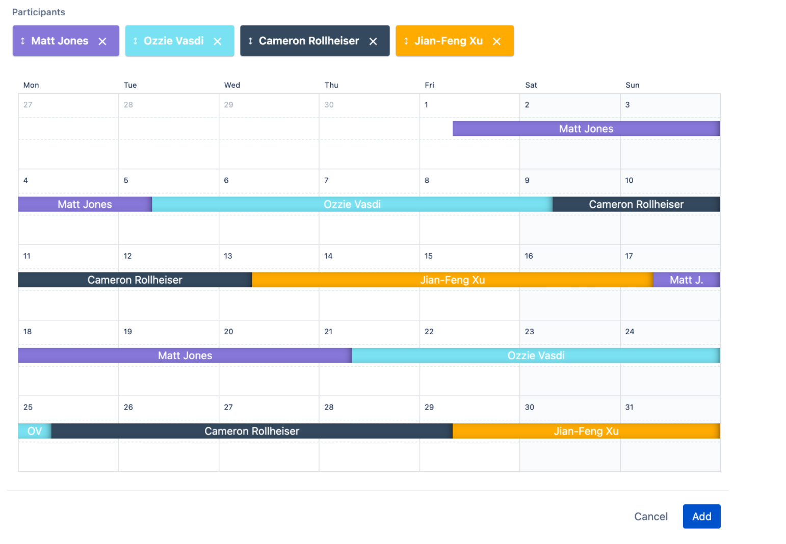
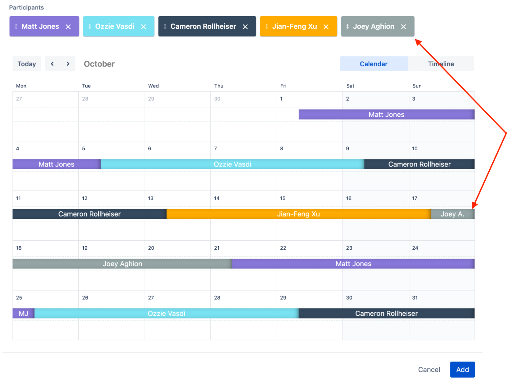
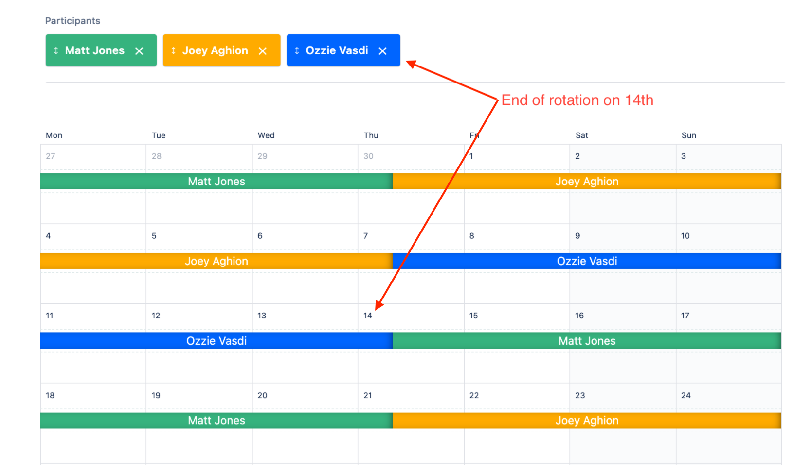

# Scheduling

The [Engineering On-Call schedule](https://artsy.app.opsgenie.com/teams/dashboard/ee381004-a72e-42ef-a733-b350d6693c6c/main) is configured in OpsGenie and works on a rotation basis. Each engineer will be on-call for one week per rotation. A rotation lasts for the period of time it takes for each participant to be on-call once, and will repeat itself indefinitely.

Trading shifts (because of vacations, obligations, etc.) is encouraged as long as the schedule is kept up-to-date. Please address any scheduling issues as early as possible.

## Steps for Scheduling On-Call

We use a staggered schedule to retain context and limit disruption as engineers shift in/out of rotation. "A" rotations start/end on a Monday at 11 am. "B" rotations start/end on a Wednesday at 11 am. Each engineer will be on-call once per rotation.

1. Generate a list of current engineers. This should include everyone who started before the next round is supposed to begin (you can use [Bamboo](https://artsy.bamboohr.com/anytime/directory.php) as a reference).  Bonus points for using [artsy-cli](https://github.com/artsy/artsy-cli):
   
   ```
   $ artsy on-call:list --team-name=Engineering-team --randomize --split=2
   ```

2. Split engineers into A and B groups. Group B should include all engineers located outside of the US Eastern Time zone. This ensures that we always have one engineer on-call during Eastern working hours.

3. Identify any exceptions/special cases and address them. These may include:
    - People who have very recently started (as a courtesy, you should schedule them towards the end of the round)
    - An unbalanced number of rotation participants. If staff locations result in one rotation having significantly fewer engineers, you should prioritize a balanced rotation schedule over Eastern Time Zone coverage.

4. Create a new A rotation:
    - Name the new rotation "rot-a-next"
    - Add all participants from group A into the A rotation
    - Set the rotation type to "weekly"
    - Set the "Start on" date to January 8th (the end of the holiday schedule)
    - Set the "End on" date to December 20th (the start of the holiday schedule).

5. Create a new B rotation:
- Name the new rotation "rot-b-next"
- Add all participants from group B into the rotation
- Set the rotation type to "weekly"
- Set the "Start on" date to January 8th (the end of the holiday schedule)
- Set the "End on" date to December 20th (the start of the holiday schedule).

6. Put a note in the #dev channel announcing that the new rotations are up. This may look something like this:
   > @developers Hello team! :wave:
   >
   > The upcoming Engineering On-Call rotations are up on OpsGenie. Please take some time to review the schedule
   > and trade shifts as needed.

## Holiday Scheduling

Holiday on-call shifts will take place from December 21st to Janurary 6th, these holiday rotations are labeled `Holiday-a` and `Holiday-b`.
During this time, on-call shifts will be on a volunteer basis and rotate every two days.

To volunteer for a holiday shift:

1. Navigate to [Engineering On-Call Schedule][schedule]
2. Browse any of the available holiday rotations

  

3. Refer to the existing Trading/Overriding instructions to assign yourself a shift.

**To note**: No need to edit the original Holiday-a/Holiday-b rotations, these shifts will be handled as overrides.

## Trading / Overriding Shifts

To switch shifts you may schedule an override in OpsGenie.

To override a shift:

1. Navigate to [Engineering On-Call Schedule][schedule]
1. Find and hover over the shift and click override:

   

1. You may want to update the default configuration:

   - By default, you will take the shift. If you'd like to assign someone else, search for and assign them
   - By default, you will override the entire shift. If you'd like to partially override the shift, adjust the
     Starts/End on dates

   

1. Click "Add" and verify your override:

   

## **Adding Engineers**

Generally, new engineers should be added to the end of the schedule rotation associated with their time zone. To do this:

1. If the engineer doesn't have an Opsgenie account already, [create an one for them](/Users/mattjones/code/README/playbooks/support/scheduling.md) in the Settings -> Users page, then [add them](https://support.atlassian.com/opsgenie/docs/create-a-team-and-add-members/)to the Engineering team in the Engingeering members page (Teams -> Engineering -> Members).

2. Navigate to the [On-Call Schedule](https://artsy.app.opsgenie.com/teams/dashboard/ee381004-a72e-42ef-a733-b350d6693c6c/main) and edit the engineer's respective rotation.

   
   

3. Add the engineer to the end of the participants list. Their position in the rotation will match their position in the participants list on the rotation edit page, for example:

Considerations when adding a new engineer:

- A new hire should be given 60 days after their start date to get the necessary context before having an on-call shift. If a new engineer's start date is within 60 days of the current rotation ending, then you should delay adding them until the new rotation has started. You can identify when a new rotation ends by checking the end date of the last participant's next rotation:

   

   - We recommend setting a [Slack reminder](https://slack.com/blog/productivity/never-forget-the-little-things-with-remind) or calendar event for yourself. In Slack you can:

      > /remind me to add @new-engineer to on-call rotations in 60 days

- You should aim to avoid pairings with two new engineers and can place the new engineer earlier in the rotation to avoid this.
- **NOTE: If you add engineers anywhere other than the end of the rotation, the schedule of the engineers who have not completed their shifts will be modified, as the order of the participants matters. You should therefore update the affected engineers to avoid scheduling conflicts. You can message them something like:**

   > Hi @engingeer-whose-schedule-shifted! We've added a new engineer to the on-call schedule which has modified the dates of your on-call shift. Please take some time to review the schedule and trade shifts as needed.

   - In certain scenarios, to minimize shifting multiple engineers schedules, it may be preferable to reach out to one engineer directly and ask them to switch shifts. Something like:

      > Hi @engineer! We've added a @new-engineer to the schedule and would like to support them by not pairing them with another new engineer for their first on-call shift. Would you be able to switch shifts with them? The new dates of your on-call shift would be X to Y.

- Check for an unbalanced number of rotation participants in rot-a vs rot-b. If staff locations result in one rotation having significantly fewer engineers, you should prioritize a balanced rotation schedule over Eastern Time Zone coverage.

## Removing  Engineers

When an engineer leaves:

- They will be replaced with a no-one placeholder in the schedule as part of the [off-boarding checklist](https://docs.google.com/document/d/10mmqkXnYVp0ZOmF5JwVPyxkzcyIN-rqO8prHgIi11lw/edit).
- The user’s manager will be asked (in #dev-managers) to override that shift with themselves.
- Their Opsgenie user account will be deleted.


Responsibility of the departing engineer's manager:

- Once an engineering manager overrides the departing engineer's next shift with yourself, they should remove the no-one placeholder from the participants list. 