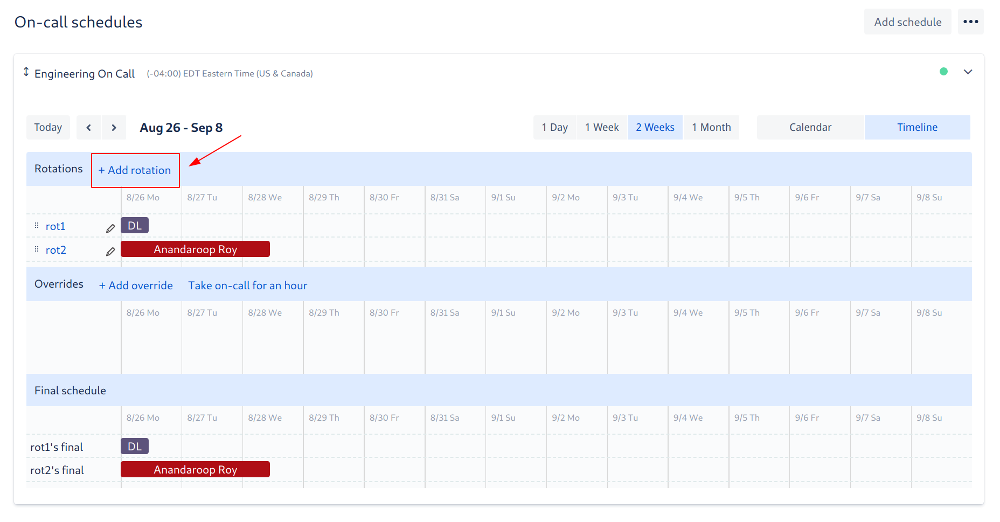
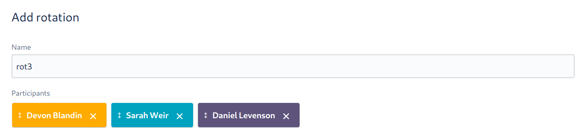
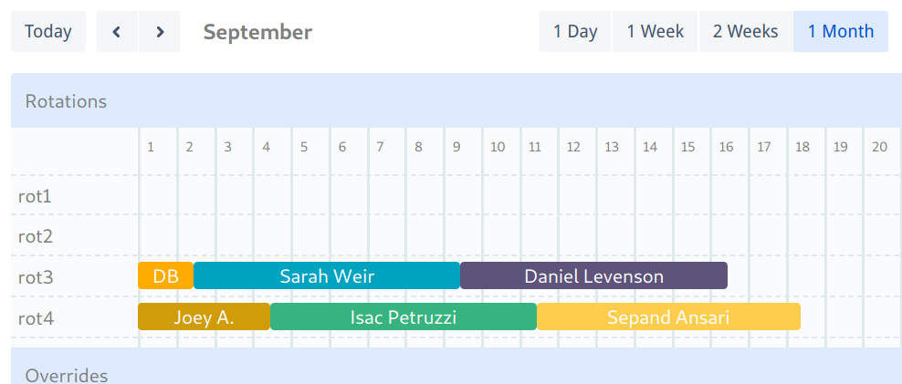

# Scheduling

The [Engineering On-Call schedule][schedule] is configured in OpsGenie. Trading shifts (because of vacations,
obligations, etc.) is encouraged as long as the schedule is kept up-to-date. Please address any scheduling issues
as early as possible.

A month before the next round of on-call is slated to begin (can check when the current round ends to verify this
timeline), we being scheduling the next round.

## Steps for Scheduling On-Call

1. Generate a list of current engineers. This should include everyone who started before the next round is supposed
   to begin (can use [Team Navigator][] as a reference)
1. Randomly split engineers into two groups (A and B)
1. Create a new OpsGenie rotation (1 of 2)

   - Add all participants from group A into the rotation
   - Set the rotation type to "weekly"
   - Set the "Start on" date to correspond with the "End on" date from the previous first rotation
   - Set the "Ends on" date far out enough so that every participant has one shift

   
   
   
   

1. Create a new OpsGenie rotation (2 of 2)

   - Add all participants from group B into the rotation
   - Set the rotation type to "weekly"
   - Set the "Start on" date to correspond with the "End on" date from the previous second rotation
   - Set the "Ends on" date far out enough so that every participant has one shift

1. Identify any exceptions/special cases and address them. These may include:

   - People who doubled-up the last round (should be left out of this round)
   - People who have very recently started (as a courtesy, you should schedule them towards the end of the round)

1. Put a note in the #dev channel announcing that the new rotations are up. This may look something like:

   > @developers Hello team! :wave:
   >
   > The upcoming Engineering On-Call rotations are up on OpsGenie. Please take some time to review the schedule
   > and trade shifts as needed.

1. Schedule a reminder to repeat this process for the next round

[team navigator]: https://team.artsy.net

## Trading / Overriding Shifts

To switch shifts you may schedule an override in OpsGenie.

To override a shift:

1. Navigate to [Engineering On-Call Schedule][schedule]
1. Find the shift you'd like to override
1. Hover over the shift and click override

   

1. You may want to update the default configuration

   - By default, you will take the shift. If you'd like to assign someone else, search for and assign them
   - By default, you will override the entire shift. If you'd like to partially override the shift, adjust the
     Starts/End on dates

   

1. Click Add and verify your override.

   

[schedule]: https://artsy.app.opsgenie.com/teams/dashboard/ee381004-a72e-42ef-a733-b350d6693c6c/main
