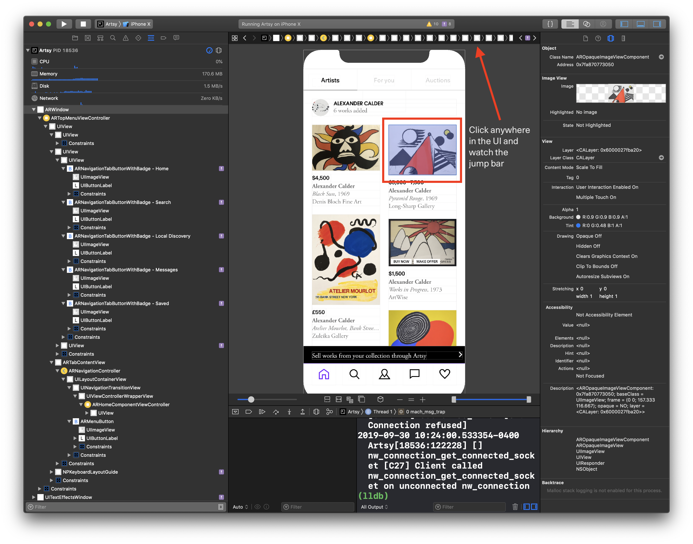

## Setup

You need to have Xcode installed, running a version of Eigen ([here are the docs][getting_started]). You don't need
to have [Eigen and Emission linked](https://github.com/artsy/eigen/blob/master/docs/using_dev_emission.md) if you
just want to find the code – linking is only required if you want to debug/modify any React Native components in
Emission.

## Finding the Code

View controllers are the main unit of composition for iOS apps, and Artsy's app is no exception. Even our React
Native components are represented by view controllers. **Finding the code for some piece of user interface is
_really_ about finding its view _controller_**. We'll use Xcode's visual debugger for that.

Build-and-run the app (the "play" button in Xcode, or ⌘R) and wait for it to launch in the simulator. In the
simulator, navigate to the UI that you're trying to find the code for. Then open Xcode's visual debugger (it's the
weird little icon near the bottom of the screen):

Xcode will show you a visual debugger. Click somewhere – anywhere, really – in the user interface that you're
trying to locate code for. When you select the element (single-click!) then the jump bar at the top of the screen
will show you the ancestors of the selected view. View _controllers_ are in orange.

You're looking for the _right-most controller_. This is the "nearest ancestor" to the selected view. You can click
on the jump bar item for the controller to focus it.

In this example, the controller is `ARHomeComponentViewController`. We can then use Xcode's "quick open" (⌘⇧O) to
navigate to the file quickly. If the code is in Eigen, we're done! If the code is in Emission (all React Native
controllers end with `ComponentViewController`) then we have to dig deeper. Let's continue the above example.

Open the implementation file for the component controller (ie: `ARHomeComponentViewController.m`) and look for the
call to the `super`'s `init` method [`initWithEmission:moduleName:initialProperties`][init]. Note the second
parameter, `moduleName`.

To get from the Objective-C controller to the React Native component, open Emission's [`AppRegistry.tsx`
file][registry] and look for the string literal that matches the `moduleName` (`"Home"`, in this case, located
[here][registry_code]). This will point you to the top-level React Native component that represents this controller
([here][code] in our example), and you can drill down the component hierarchy from here.

[getting_started]: https://github.com/artsy/eigen/blob/master/docs/getting_started.md
[registry]: https://github.com/artsy/emission/blob/master/src/lib/AppRegistry.tsx
[registry_code]:
  https://github.com/artsy/emission/blob/8ca8f40782ca9308fcb89a29ece2a84eef499388/src/lib/AppRegistry.tsx#L337
[code]: https://github.com/artsy/emission/blob/master/src/lib/Scenes/Home/index.tsx
[init]:
  https://github.com/artsy/emission/blob/8ca8f40782ca9308fcb89a29ece2a84eef499388/Pod/Classes/ViewControllers/ARHomeComponentViewController.m#L26-L28
