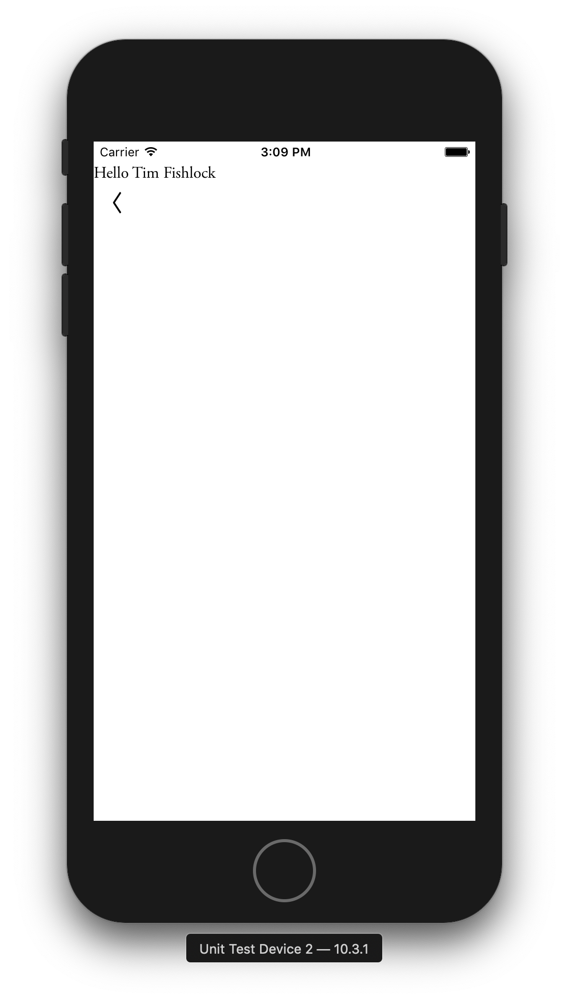

# iOS Learning Group Session Three

## Homework review

- What is the purpose of a view controller, from a developer's perspective? What about from a user's perspective?

<details>
<summary>Answer</summary>

Recall from the last session that a view controller fits within the iOS Model-View-Controller framework. View
controllers are the glue between data models and user interfaces, mediating updates from the data models and user
interactions from the UI. A view controller is the main unit of composition for building native iOS UI's. From a
user's perspective, they might call it "a screen", since view controllers commonly take up the entire screen of an
app. However, view controllers really can be _composed_ so while a view controller might indeed take up the entire
screen, it might be composed of child controllers as the develop sees fit.

</details>

- How does a parameters on the Objective-C view controller `init` method get sent to the React component hierarchy
  as a prop?

<details>
<summary>Answer</summary>

The parameter gets passed into the `initialProperties` parameter of the call to `super`'s
`initWithEmission:moduleName:initialProperties`. You need to add the prop to the component's `Props` type to access
it using TypeScript.
[Here are the docs](https://facebook.github.io/react-native/docs/native-modules-ios#argument-types) that describe
translating Objective-C types into JavaScript types.

</details>

- We've seen how to create new controllers and link them with Eigen. Routing between view controller is all
  URL-based; what are the advantages and disadvantages to this approach?

<details>
<summary>Answer</summary>

**Advantages**: Getting to use the same URL's as the web means push notifications, deep links, and email deep links
all use the same routing infrastructure as UI interactions. We also get to fall back to web views for URLs that the
app doesn't handle.

**Disadvantages**: Data passed from one controller to another has to be serialized into a URL first. Common
patterns such as passing `delegate` references or completion handlers forward to new view controllers is not
possible.

</details>

- Related: in `ARSwitchBoard.m`, you'll see two different methods for adding routes: `addRoute:handler:` and
  `registerEchoRouteForKey:handler:`. This lets us define routing URL's in [Echo](https://github.com/artsy/echo),
  Artsy's feature-flag-as-a-service. Why do you think this added functionality here?

<details>
<summary>Answer</summary>

This was added very early so that Force could update its URLs and Eigen could be updated remotely to match the new
scheme. It's never been used, though.

</details>

- Extra credit: Emission's `ARComponentViewController` defines a few props that get passed down based on iOS View
  Controller lifecycle methods. What are they? (Hint: [here is a PR](https://github.com/artsy/emission/pull/1890)
  that uses them.)

<details>
<summary>Answer</summary>

The `isVisible` is passed to all top-level components (ie: components backed by a component view controller). This
lets the component know if it's currently visible to the user or not.

</details>

<!--
This week, we will create our own React component to fit within the new view controller from Week 3. This will be a
Relay container, fetching data from Metaphysics v2. We will cover how to fetch data, how to re-fetch data, as well
as how Eigen and Emission integrate together to provide client-side API response caches (both Relay and others).
-->

## Making a Relay Component

Last week we built the following `MyNewComponent`:

```tsx
export class MyNewComponent extends React.Component {
  render() {
    return <Serif size="3t">Hello world!</Serif>
  }
}
```

This doesn't really do anything. This week, we're going to look at turning this into a **Relay component** that
fetches actual data from Metaphysics v2. To keep things simple, **we will be staying totally within the Emission
test app**.

Let's start by checking out the code from the end of last session:

```sh
# cd into Emission's repo
git fetch --tags # Required!
git checkout ios-learning-session-three-finished
git checkout -b ios-learning-group-session-four
```

Okay, let's start turning this into a Relay component. It's an iterative process, and we're going to work on small
pieces at a time. Let's apply the following diff to `MyNewComponent.tsx`:

```diff
 import { Serif } from "@artsy/palette"
 import React from "react"
+import { createFragmentContainer, graphql, RelayProp } from "react-relay"

-export class MyNewComponent extends React.Component {
+interface Props {
+  relay: RelayProp
+}
+
+export class MyNewComponent extends React.Component<Props> {
   render() {
     return <Serif size="3t">Hello world!</Serif>
   }
 }
+
+export const MyNewComponentFragmentContainer = createFragmentContainer(
+  MyNewComponent,
+  {
+    artist: graphql`
+      fragment MyNewComponent_artist on Artist {
+        name
+      }
+    `,
+  }
+})
```

This wraps the existing `MyNewComponent` in a fragment container. Since Reaction and Emission are both built with
Relay, this code is nearly identical across the web and React Native platforms.

Next we need to get the Relay compiler to generate some types for us. If you don't have `yarn start` running, then
you can run `yarn relay` instead to generate them. Then, we can import the type and start using the prop:

```diff
 import { Serif } from "@artsy/palette"
 import React from "react"
 import { createFragmentContainer, graphql, RelayProp } from "react-relay"
+import { MyNewComponent_artist } from "__generated__/MyNewComponent_artist.graphql"

 interface Props {
+  artist: MyNewComponent_artist
   relay: RelayProp
 }

 export class MyNewComponent extends React.Component<Props> {
   render() {
-    return <Serif size="3t">Hello world!</Serif>
+    return <Serif size="3t">Hello {this.props.artist.name}</Serif>
   }
 }
```

Cool! So you can see the workflow is very similar to Reaction:

1. Wrap a component in a Relay fragment container with a defined GraphQL fragment.
2. Run `yarn relay` (or keep `yarn start` running, which runs Relay in watch mode) to generate the types.
3. Import the types and add the prop you're fetching.
4. Use the prop.

Okay so let's do a little more work here to get the component rendered from native code. Remember, we're just
sticking to Emission for now, there would be extra steps to integrate this into Eigen
([here is an example commit](https://github.com/artsy/eigen/commit/189f55eb15538af32f1fb910f0830e999fddca6b)).

Next step: we need a query renderer. This can get a little confusing because we have _yet another_ layer of
indirection. Here's how you can think of the various pieces:

```
MyNewComponentQueryRenderer     <- Defines how to fetch the data.
MyNewComponentFragmentContainer <- Defines what data to fetch.
MyNewComponent                  <- Defines what to do with the data once its fetched.
```

Most query renderers look very similar (because we've structured our code to make them similar, and boring). It's
not [DRY](https://en.wikipedia.org/wiki/Don%27t_repeat_yourself) but it has a lot of benefits, like how everything
is explicit and doesn't rely on developers having the right context to understand how things work. So let's write
our query renderer.

Query renderers used to be all defined in
[their own file](https://github.com/artsy/emission/blob/master/src/lib/relay/QueryRenderers.tsx) but the common
practice now is to define them in the same file as the component and fragment container. Add the following to the
end of `MyNewComponent.tsx`:

```tsx
export const MyNewComponentQueryRenderer: React.SFC<{ artistID: string }> = ({ artistID, ...others }) => {
  return (
    <RetryErrorBoundary
      render={() => {
        return (
          <QueryRenderer
            environment={defaultEnvironment}
            query={graphql`
              query MyNewComponentQuery($artistID: String!) {
                artist(id: $artistID) {
                  ...MyNewComponent_artist
                }
              }
            `}
            variables={{
              artistID
            }}
            render={renderWithLoadProgress(MyNewComponentFragmentContainer, others)}
          />
        )
      }}
    />
  )
}
```

There's a lot going on here, but the really important part is this line:

```tsx
render = { renderWithLoadProgress(MyNewComponentFragmentContainer, others) }
```

`renderWithLoadProgress` shows a spinner for the user while the query is fetched from Metaphysics, which is really
nice.

If your VSCode is setup to automatically apply ESLint fix-its, then this next step might be done automatically. We
use a lint rule to automatically apply a TypeScript generic to `QueryRenderer`. You can see the diff here:

```diff
 import React from "react"
 import { createFragmentContainer, graphql, RelayProp, QueryRenderer } from "react-relay"
 import { MyNewComponent_artist } from "__generated__/MyNewComponent_artist.graphql"
+import { MyNewComponentQuery } from "__generated__/MyNewComponentQuery.graphql"
 import { RetryErrorBoundary } from "./RetryErrorBoundary"
 import { defaultEnvironment } from "lib/relay/createEnvironment"
 import renderWithLoadProgress from "lib/utils/renderWithLoadProgress"
@@ -40,7 +41,7 @@ export const MyNewComponentQueryRenderer: React.SFC<{ artistID: string }> = ({ a
     <RetryErrorBoundary
       render={() => {
         return (
-          <QueryRenderer
+          <QueryRenderer<MyNewComponentQuery>
             environment={defaultEnvironment}
             query={graphql`
               query MyNewComponentQuery($artistID: String!) {
```

Okay! We're all set, we just need to define the prop in our Objective-C class, `MyNewComponentViewController`. Open
`MyNewComponentViewController.h` and make the following change:

```diff
 @interface ARMyNewComponentViewController : ARComponentViewController

-- (instancetype)init;
+- (instancetype)initWithArtistID:(NSString *)artistID;

+ @property (nonatomic, readonly) NSString *artistID;

 @end
```

And make a similar change to the `.m` file:

```diff
 @implementation ARMyNewComponentViewController

-- (instancetype)init;
+- (instancetype)initWithArtistID:(NSString *)artistID;
 {
-    return [super initWithEmission:nil
-                        moduleName:@"MyNewComponent"
-                 initialProperties:@{}];
+    if ((self = [super initWithEmission:nil
+                             moduleName:@"MyNewComponent"
+                      initialProperties:@{ @"artistID": artistID }])) {
+        _artistID = artistID;
+    }
+    return self;
 }
```

This change will inject the `artistID` as an initial property, which is used by the `QueryRenderer` and passed
along to Metaphysics as a query variable. Cool! If you opened Emission's Example app in Xcode, you'll see that it
will fail to compile because we aren't using the new `artistID` parameter yet. We'll need to make a change to our
`ARRootViewController.m` file to use this new parameter:

```diff
 - (ARCellData *)jumpToMyNewComponent
 {
   return [self tappableCellDataWithTitle:@"My New Component" selection: ^{
-    [self.navigationController pushViewController:[[ARMyNewComponentViewController alloc] init] animated:YES];
+    [self.navigationController pushViewController:[[ARMyNewComponentViewController alloc] initWithArtistID:@"tim-fishlock"] animated:YES];
   }];
 }
```

For Emission's test app, it's okay to use hardcoded IDs like this. The app is just to help us test, afterall, so we
can change these to whatever artist we want.

Finally, we need to rewire the `AppRegistry` to point to the new query renderer:

```diff
-import { MyNewComponent } from "./Components/MyNewComponent"
+import { MyNewComponentQueryRenderer as MyNewComponent } from "./Components/MyNewComponent"
```

If you recompile the app in Xcode and tap the "MyNewCompent", you sould see the following:



Awesome! Our next steps are some cleanup, and then to deploy Emission and update Eigen. But we're skipping the
deploy step for this tutorial, so let's do some cleanup.

You'll recall from the last session that we created a Storybook entry for `MyNewComponent`. Let's update
`MyNewComponent.story.tsx` to work with the new query renderer.

```diff
 import { storiesOf } from "@storybook/react-native"
 import React from "react"
-import { MyNewComponent } from "../MyNewComponent"
+import { MyNewComponentQueryRenderer as MyNewComponent } from "../MyNewComponent"

-storiesOf("MyNewComponent").add("Show default component", () => {
-  return <MyNewComponent />
+storiesOf("MyNewComponent").add("Show Tim Fishlock", () => {
+  return <MyNewComponent artistID="tim-fishlock" />
 })
```

And that's it! Completed code from this session can be found in Emission's repo at
[the `ios-learning-group-session-four-finished` tag](https://github.com/artsy/emission/releases/tag/ios-learning-group-session-four-finished).

## What about the Query Map?

When ran in development mode, Emission sends the full GraphQL query and variables to Metaphysics. However, in
deployed versions (App Store releases **and** betas!) don't do this. Instead, they use GraphQL persisted queries.
Metaphysics has a
[flat JSON file](https://github.com/artsy/metaphysics/blob/9b782b05e9e7da08937581fddb4ef1cf315e2136/src/data/complete.queryMap.json)
that defines every query of every version of Emission ever released. When a new version of Emission is made, the
release script automatically generates a new query map, merges it with the existing one, and opens a pull request
([exmaple](https://github.com/artsy/metaphysics/pull/1993)).

(In the longterm, we plan to move away from a flat file for persisted queries. This will unlock other clients to
use the persisted queries, too, since Emission is currently the only one.)

Until this PR is merged, the updated query map won't be deployed to staging. That means that the build of Emission
won't work at all. Once deployed to staging, the build will work _only on staging_. Until we promote Metaphysics to
production, queries will fail on production. **This is a common source of bug reports** from colleagues when we cut
a new beta. If you release Emission, make sure to communicate with your team and in the #front-end-ios Slack
channel.

## Core Concept Review & Homework

- Come prepared with a bug or feature from your team's backlog to work on. Session Five will be a working session,
  where we'll either pair or mob as a group on these issues.
- We saw how React apps, and Emission in particular, avoid DRY software development. What do you think of this?
  Why?
- Emission is currently the only client to use persisted queries. Why do you think Emission uses them while other
  client apps (like Volt and Reaction) don't yet?
- Extra credit: We see that the content of our component is touching the top edge of the simulator screen. This
  makes sense,but poses a problem. What do you think the problem is, and how do you think we could fix it? Hint:
  take a look around the Emission codebase for "SafeAreaInsets" and see what you find.

## Resources / Recommended Reading

- [Relay docs](https://relay.dev)
- [JavaScriptures session on Relay](https://artsy.github.io/blog/2018/06/13/JavaScriptures-4.1-Relay/)
