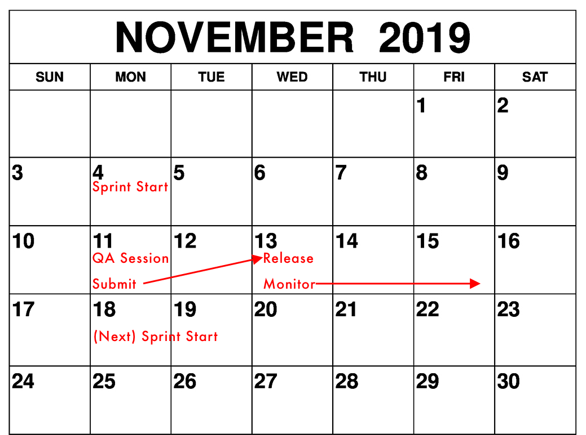

# 2-week Release Cadence

After researching
[other companies' practices](https://www.notion.so/artsy/Investigate-Industry-Use-of-App-Release-Cadences-5a32fc82550841b984eacc96db46d9ee)
🔐, we're going to implement a 2-week app release cadence. Our app gets the most use on the weekends, so we want to
make sure any new features are released (and monitored) ahead of the weekend.

## Principles

- All product work is kept behind a Lab Option ([example PR](https://github.com/artsy/eigen/pull/2934))
- When ready to be deployed, risky features should be put behind Echo flags
  ([example PR](https://github.com/artsy/eigen/pull/2937))

## Cadence

Below is a hypothetical release calendar showing how sprints align with App Store submissions and release.

Let's consider a 10-day sprint (2 weeks = 10 business days). We would commit to the following:

- **Sprint Start +0days** → Start the sprint
  - Use next 5 days to complete any work we want to release this sprint.
- **Sprint Start +5days** → Test our work in Sprintly QA Session
  - We have that afternoon to fix bugs, or put disable the Echo flag for broken features
  - To keep teams unblocked, any changes should go into a separate branch, which we can merge into master after
    being released.
- **Sprint Start +5 days** → Submit to App Store review (pending our release)
  - Once we get approval, we can choose when to release to users.
  - Approval typically takes a day.
- **Sprint Start +7days** → Release to users. Monitor.
  - We would wait until Wednesday to release and monitor. This gives us two business days to submit any emergency
    hot fixes, but ideally, we could just disable the Echo flag for catastrophic bugs.

In effect, this splits our sprint work into two sections: work we expect to release this sprint, and work that we
plan on _doing_ this sprint but won't get released until next sprint. Submitting halfway through a sprint, and
releasing at the top of the next sprint, does introduce some complexity. However, we can socialize the schedule and
get everyone on-board.

The alternative would be to release at the start/end of a sprint, but since App Store reviews and releases take
such a long time, we would rather have our cadence embrace this ambiguity by submitting mid-sprint.

## Monitoring

It's important to note that beyond **Sentry** monitoring, which can only report crashes once the app has successful
launched a subsequent session, we need to also **monitor Apple crash reports**. These reports are opt-in, so we'll
see fewer of them, but are done at an OS-level that doesn't require the app to successfully launch. This would help
us catch crashing bugs that prevent the app from launching at all, such as Incident 61
([see postmortem](https://artsy.app.opsgenie.com/reports/post-mortem/056fd5f9-66e4-4e96-81e7-4f39f9884b9c/detail)
🔐).
