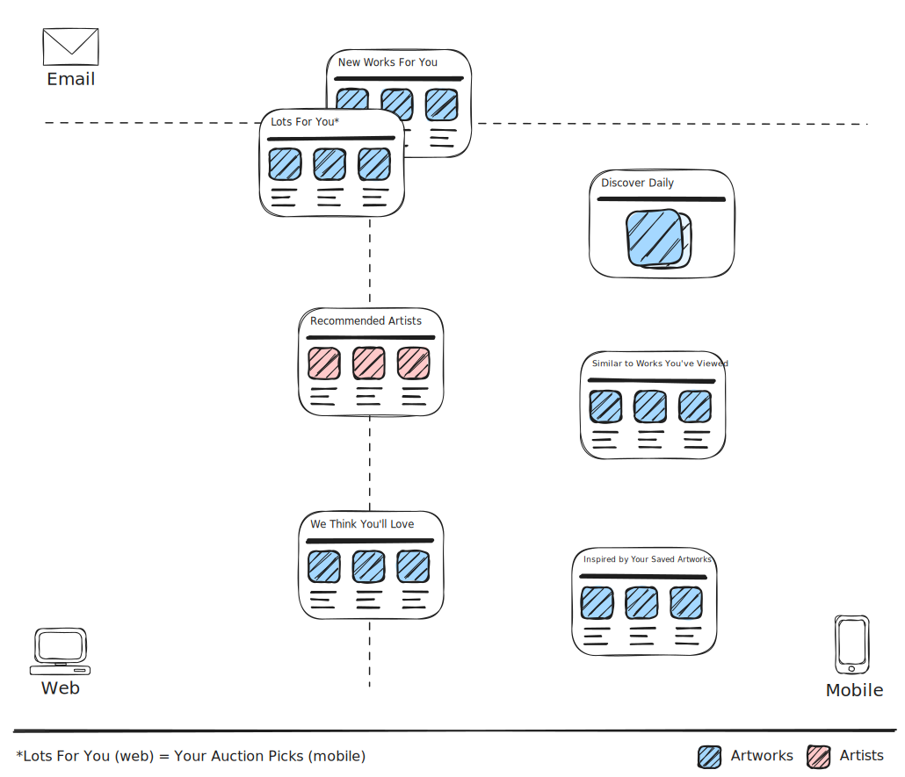
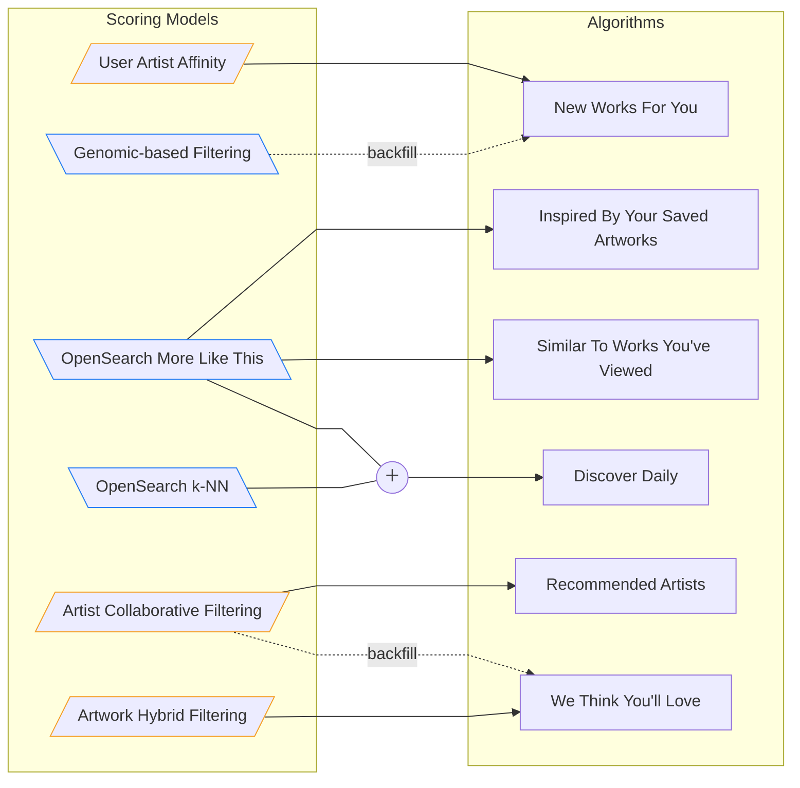
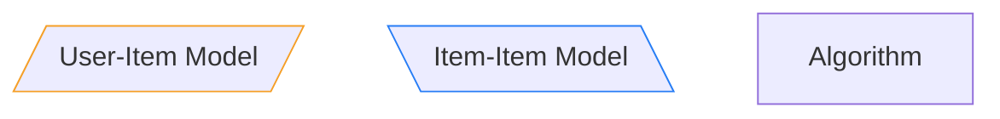

Algorithmic recommendations surfaces (henceforth, just recommendations surfaces) are UI components featuring a list of entities (e.g., artworks, artists) produced by algorithms that transform user signals (e.g., views, follows, saves, purchases etc) into scores for selecting and ranking such entities&mdash;rather than _exclusively_ reflecting user inputs (e.g., filters, budget preferences) or contextual metadata (e.g., location). The scores produced by these algorithms typically represent the user's preference for each entity.

An overview of the recommendations surfaces by channel at Artsy is shown below.

<picture>
  <source media="(prefers-color-scheme: dark)" srcset="recommendations/images/recs_surf_dark.svg">
  <source media="(prefers-color-scheme: light)" srcset="recommendations/images/recs_surf_light.svg">
  
</picture>

## What is a Recommendations Algorithm?

A recommendation algorithm is typically composed of three distinct phases:

1. **Candidate Generation**: Filtering the item space to a manageable set of candidates (e.g., artworks published in the last 30 days, excluding already-seen items).
2. **Scoring**: Assigning a relevance score to each candidate based on user signals involving items, and optionally user and item metadata.
3. **Re-ranking**: Applying business rules, diversity constraints, or presentation logic to the scored candidates (e.g., interleaving artists, injecting curated picks).

The workhorse of any algorithm is undoubtedly its **scoring function**&mdash;the component that transforms input data into preference scores. However, what happens before and after scoring is also important, even if technically optional. In principle, you could score all available items, rank them accordingly, and call it a day. In practice, candidate generation keeps computation tractable, and re-ranking ensures the final list meets product requirements.

### Types of Scoring Models

Scoring models fall into two broad categories based on their inputs:

- $f(\text{user}, \text{item}) \to \mathbb{R}$: Models that transform user signals into a preference score for an item. A popular class of models in this category can take a user and an item as inputs, embed them into the same multidimensional space and use a geometric similarity as a proxy for preference.
- $f(\text{item}, \text{item}) \to \mathbb{R}$: Models that take a seed item and a candidate item and output a similarity score. These are typically content-based, computing similarity from item features, metadata, or embeddings. The trick often used to make user recommendations is to consider a user as an "average" of the items they've interacted with.

## What Recommendations Are Not

In the field of Information Retrieval, recommender systems are sometimes referred to as active filtering (i.e., push content), whereas traditional search engines are passive filtering (i.e., pull content), but the key distinctive principle is whether user signals shape the scoring context or enter the scoring function directly.

For example, "Shows For You" are not recommendations because they exclusively utilize the user's location to return nearby shows. Although less obvious, "Galleries for You" is also not a recommendations surface. While it shows galleries that have published artworks by artists the user follows sorted by proximity, it utilizes _follows_ as a constrained search without transforming this signal into a score. More formally, $\text{distance}(\text{user}, \text{gallery})$ is the scoring function powering "Galleries for You" which&mdash;arguably&mdash;does not reflect the user's preferences. For it to be recommendations it would need a function such as $\text{affinity}(\text{user}, \text{gallery})$.

An even more striking counter-example is "Sort By: Recommended"&mdash;the default artwork sorting option that utilizes a function akin to $\text{merchandisability}(\text{artwork})$. Despite its displayed text, this is not a recommendations system. The [🔒 merchandisability heuristic](https://github.com/artsy/gravity/blob/5524122/app/models/search/queries/filtered_query.rb#L30-L45) combines several metrics including a Machine Learning (ML) generated base score and an exponential decay as a function of time since publication. However, all these factors are properties of the artwork itself&mdash;not transformations of user signals into preference scores.

One final note on scope: curated recommendations&mdash;such as those surfaced in "Curators' Picks"&mdash;are obviously excluded. While not algorithmic, they serve an important role as a backfill or contingency, for example to mitigate the new-user case of the [cold-start problem](<https://en.wikipedia.org/wiki/Cold_start_(recommender_systems)>).

## Documentation Structure

Because scoring models are loosely coupled from algorithms, it's common to reuse the same model across different surfaces. The diagram below illustrates these relationships.

The rest of this documentation follows an **algorithm-first narrative**. Each page covers one recommendations surface end-to-end&mdash;from candidate generation through re-ranking&mdash;introducing scoring models as they appear. To avoid repetition, we discuss each model in depth once and reference it thereafter.

- [New Works For You (and Lots For You)](recommendations/new-works-for-you.md)
- [Discover Daily](recommendations/discover-daily.md)
- [Recommended Artists](recommendations/recommended-artists.md)
- [Similar To Works You've Viewed](recommendations/similar-to-works-youve-viewed.md)
- [Inspired By Your Saved Artworks](recommendations/inspired-by-your-saved-artworks.md)
- [We Think You'll Love](recommendations/we-think-youll-love.md)
