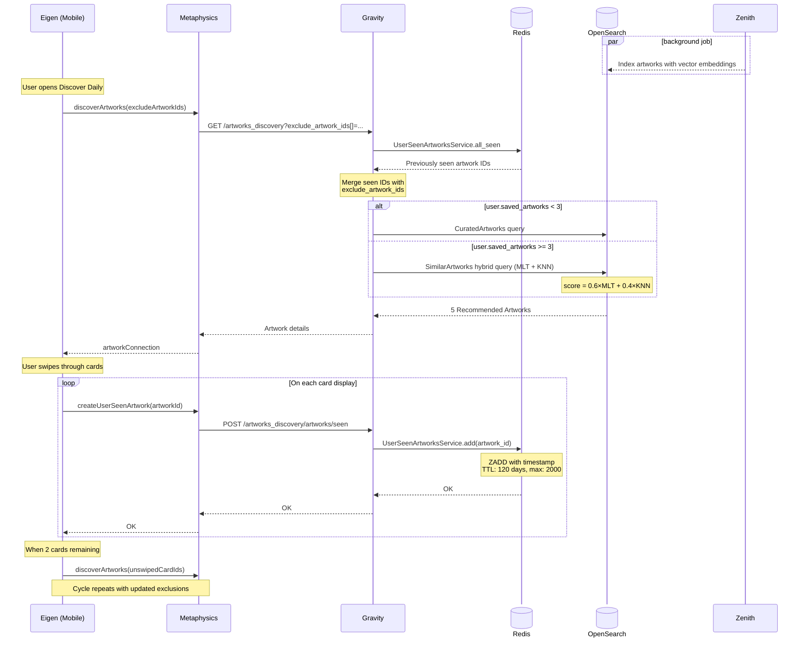

"Discover Daily" (DD)&mdash;internally known as Infinite Discovery&mdash;is a mobile-only swiping experience that surfaces personalized artwork recommendations. The feature uses a hybrid scoring model combining BM25 lexicographic search with KNN vector similarity, and implements both intra-session (client-side) and inter-session (server-side via Redis) deduplication to ensure users never see the same artwork twice.

The sequence diagram of Infinite Discovery is shown below.

Before describing the Discover Daily algorithm, we need to introduce the two scoring models that power it.

## MLT (More Like This) Model

The MLT model leverages OpenSearch's [More Like This](https://opensearch.org/docs/latest/query-dsl/specialized/more-like-this/) query to find artworks that are topically similar based on term distribution to the user's saved artworks. It operates on textual fields that describe artwork characteristics.

The model's logic can be broken down as follows:

1. Get the user's saved artworks and create set $S_u$ by extracting all terms appearing across the following fields:

   - **Genes** (e.g., ["Western Europe", "Spain", "Spain and Portugal", "1970s", "Contemporary Art", "Galleries Based Outside of Europe"])
   - **Materials** (e.g., "Lithograph on Guarro paper")
   - **Tags** (e.g., ["Art", "Doodle", "Drawing", "Modern Art"])
   - **Medium** (e.g., "Print")

2. Remove terms where $`\text{tf}(t, S_u) < \text{min\_term\_freq}`$ where $`\text{min\_term\_freq}`$ is a tuning parameter and $\text{tf}(t, S_u)$ returns the number of occurrences of the term $t$ in $S_u$.

3. Remove terms where $`\text{df}(t, \mathcal{D}) < \text{min\_doc\_freq}`$ where $`\text{min\_doc\_freq}`$ is a tuning parameter and $\text{df}(t, \mathcal{D})$ returns the number of documents in $\mathcal{D}$&mdash;the corpus of all indexed documents&mdash;containing the term $t$.

4. Terms are scored by [TF-IDF](https://en.wikipedia.org/wiki/Tf%E2%80%93idf) and the top $`\text{max\_query\_terms}`$ constitutes the query set $R_u$.

5. For each indexed document, extract all terms appearing across the same fields and calculate [BM25](https://en.wikipedia.org/wiki/Okapi_BM25) as:

$$
\text{BM25}(R_u, D_a) = \sum_{t \in T_{R_u, D_a}}\text{IDF}(t) \cdot \frac{\text{tf}(t, D_a) \cdot (k_1 + 1)}{\text{tf}(t, D_a) + k_1 \cdot \left(1 - b + b \cdot \frac{|D_a|}{\text{avgdl}}\right)}
$$

Where:

- $T_{R_u, D_a}$ is the set of terms shared between an indexed document $D_a$ and the reference set $R_u$.
- $|D_a|$ is the length of document $D_a$.
- $\text{avgdl}$ is the average document length of documents in $\mathcal{D}$.
- $k_1$ and $b$ are tuning parameters.
- $\text{IDF}(t)$ is the inverse document frequency, computed as:

$$
\text{IDF}(t) = \ln\left(1 + \frac{|\mathcal{D}| - \text{df}(t) + 0.5}{\text{df}(t) + 0.5}\right)
$$

Below we summarize the key tuning parameters of the model.

| MLT Parameter        | Description                                                                                        | Discover Daily                 |
|----------------------|----------------------------------------------------------------------------------------------------|--------------------------------|
| fields               | Indexed fields which terms $R_u$ and $D_a$ are extracted from                                      | genes, materials, tags, medium |
| min_term_freq        | Terms appearing less than this value are removed from $R_u$                                        | 1                              |
| max_query_terms      | Max size of $R_u$                                                                                  | 25                             |
| min_doc_freq         | Terms appearing in fewer documents than this are are removed from $R_u$                            | 1                              |
| minimum_should_match | Threshold $\frac{\vert T_{R_u, D_a} \vert}{\vert R_u \vert}$ for considering $D_a$ a match         | 30%                            |
| $k_1$                | Determines how much multiple occurrences of a term within a document increase its relevance score. | 1.2                            |
| $b$                  | Controls how much the document length affects the final score                                      | 0.75                           |

## KNN (K-Nearest Neighbors) Model

The KNN model uses OpenSearch's [KNN search](https://opensearch.org/docs/latest/search-plugins/knn/index/) with vector embeddings to find artworks that are geometrically similar to the user's preferences in a high-dimensional space.

The model's logic can be broken down as follows:

1. Get the user's artworks $S_u$ and pluck the pre-calculated embeddings using [CLIP ViT-B/32](https://huggingface.co/sentence-transformers/clip-ViT-B-32)&mdash;a vision-language model that encodes images into a dense vector $\mathbf{v}_a \in \mathbb{R}^d$ where $d = 512$.

2. Compute a centroid vector representing the user's preferences by averaging the embeddings of their saved artworks:

$$
\mathbf{v}_u = \frac{1}{|S_u|} \sum_{i \in S_u} \mathbf{v}_i
$$

3. For each indexed document, compute cosine similarity:

$$
\text{similarity}(\mathbf{v}_u, \mathbf{v}_a) = \frac{\mathbf{v}_u \cdot \mathbf{v}_a}{\|\mathbf{v}_u\| \|\mathbf{v}_a\|}
$$

## Algorithm

1. _Saved Artworks_ := User's 3 most recent saved artworks (and still visible to public).
2. _Excluded Artists_ := Artists the user wants to see fewer artworks by.
3. _Excluded Artworks_ := Unswiped artworks in current batch and most recent 2000 artworks seen in previous batches over the last 120 days.
4. _Recent Artists_ := Artists of last 5 _Excluded Artworks_ or artists featured in saved artworks.
5. [if _Saved Artworks_ < 3] _Final Recommendations_ := Top-15 random curated artwork recommendations not by _Excluded Artists_ or in _Excluded Artworks_.
6. [if _Saved Artworks_ >= 3] _Curated picks_ := Random curated artwork recommendations not by _Excluded Artists_ or in _Excluded Artworks_.
7. [if _Saved Artworks_ >= 3] _MLT recommendations_ := Artworks published in the last 4 months, available for sale, not by _Excluded Artists_ or _Recent Artists_ or in _Excluded Artworks_, with BM25 scores.
8. [if _Saved Artworks_ >= 3] _KNN recommendations_ := Artworks published in the last 4 months, available for sale, not by _Excluded Artists_ or _Recent Artists_ or in _Excluded Artworks_, with KNN scores.
9. [if _Saved Artworks_ >= 3] _Hybrid recommendations_ := Artworks after combining scores of _MLT recommendations_ and _KNN recommendations_ using the weighted mean $0.6 \times \widehat{\text{BM25}}(R_u, D_a) + 0.4 \times \widehat{\text{similarity}}(\mathbf{v}_u, \mathbf{v}_a)$, where $\hat{f}(\cdot)$ are min-max normalized scores $\in [0, 1]$.
10. [if _Saved Artworks_ >= 3] _Final Recommendations_ := Top-3 _Hybrid recommendations_ and Top-2 _Curated picks_.
