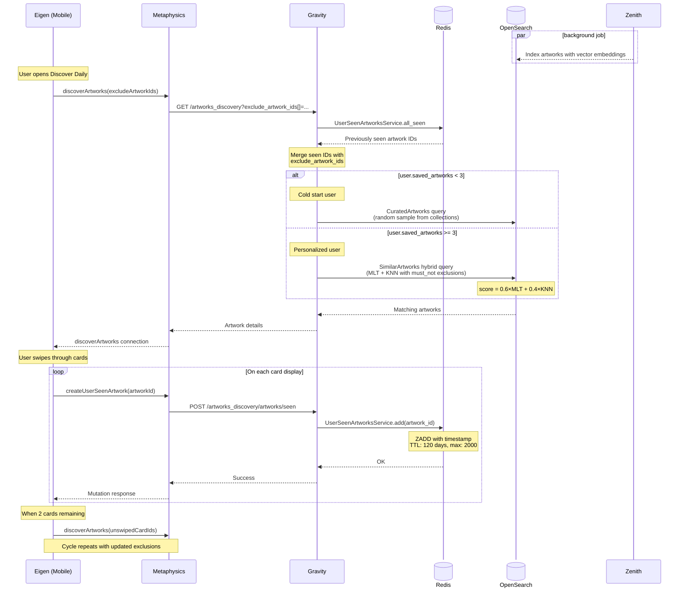

"Discover Daily" (DD)&mdash;internally known as Infinite Discovery&mdash;is a mobile-only swiping experience that surfaces personalized artwork recommendations. The feature uses a hybrid scoring model combining BM25 lexicographic search with KNN vector similarity, and implements both intra-session (client-side) and inter-session (server-side via Redis) deduplication to ensure users never see the same artwork twice.

The sequence diagram of Infinite Discovery is shown below.

Before describing the Discover Daily algorithm, we need to introduce the two scoring models that power it.

## MLT (More Like This) Model

The MLT model leverages OpenSearch's [More Like This](https://opensearch.org/docs/latest/query-dsl/specialized/more-like-this/) query to find artworks that are lexicographically similar to the user's saved artworks. It operates on textual fields that describe artwork characteristics.

The model's logic can be broken down as follows:

1. Get the user's saved artworks $S_u$, extract **all** terms appearing across the following fields and create a reference set of query terms $R_u$:

   - **Genes** (e.g., ["Western Europe", "Spain", "Spain and Portugal", "1970s", "Contemporary Art", "Galleries Based Outside of Europe"])
   - **Materials** (e.g., "Lithograph on Guarro paper")
   - **Tags** (e.g., ["Art", "Doodle", "Drawing", "Modern Art"])
   - **Medium** (e.g., "Print")

2. For each indexed document, extract all terms appearing across the same fields and calculate [BM25](https://en.wikipedia.org/wiki/Okapi_BM25) as:

$$
\text{BM25}(R_u, D_a) = \sum_{t \in T_{R_u, D_a}}\text{IDF}(t) \cdot \frac{f(t, D_a) \cdot (k_1 + 1)}{f(t, D_a) + k_1 \cdot \left(1 - b + b \cdot \frac{|D_a|}{\text{avgdl}}\right)}
$$

Where:

- $T_{R_u, D_a}$ is the set of terms shared between an indexed document $D_a$ and the reference set $R_u$.
- $f(t, D_a)$ is the frequency of term $t$ in document $D_a$.
- $|D_a|$ is the length of document $D_a$.
- $\text{avgdl}$ is the average document length in the corpus from which $D_a$ was drawn.
- $k_1$ and $b$ are tuning parameters (OpenSearch defaults: $k_1 = 1.2$, $b = 0.75$).
- $\text{IDF}(t)$ is the inverse document frequency, computed as:

$$
\text{IDF}(t) = \ln\left(1 + \frac{N - n(t) + 0.5}{n(t) + 0.5}\right)
$$

Where $N$ is the total number of documents in the corpus and $n(t)$ is the number of documents containing term $t$.

The key properties of BM25 that make it effective for artwork similarity:

- **Term frequency saturation**: Repeated terms contribute diminishing returns, preventing artworks with repetitive descriptors from dominating.
- **Document frequency weighting**: Common terms contribute less, while rare, distinctive terms contribute more.
- **Length normalization**: Longer descriptions don't unfairly advantage artworks with more metadata.

### KNN (K-Nearest Neighbors) Model

The KNN model uses OpenSearch's [KNN search](https://opensearch.org/docs/latest/search-plugins/knn/index/) with vector embeddings to find artworks that are geometrically similar to the user's preferences in a high-dimensional space.

The model's logic can be broken down as follows:

1. Get the user's artworks $S_u$ and pluck the pre-calculated embeddings using [CLIP ViT-B/32](https://huggingface.co/sentence-transformers/clip-ViT-B-32)&mdash;a vision-language model that encodes images into a dense vector $\mathbf{v}_a \in \mathbb{R}^d$ where $d = 512$.

2. Compute a centroid vector representing the user's preferences by averaging the embeddings of their saved artworks:

$$
\mathbf{v}_u = \frac{1}{|S_u|} \sum_{a \in S_u} \mathbf{v}_a
$$

3. Use OpenSearch's Approximate KNN search to find the $k$ nearest artworks to $\mathbf{v}_u$ using cosine similarity:

$$
\text{similarity}(\mathbf{v}_u, \mathbf{v}_a) = \frac{\mathbf{v}_u \cdot \mathbf{v}_a}{\|\mathbf{v}_u\| \|\mathbf{v}_a\|}
$$

The key properties of KNN that complement MLT:

- **Semantic understanding**: Captures relationships that aren't explicit in metadata. Two artworks may share visual or conceptual similarity even without overlapping genes or tags.
- **Generalization**: The centroid vector represents the user's "average taste", enabling discovery of artworks that match the overall preference pattern rather than specific saved items.
- **Handling sparse metadata**: Works well even when artworks have limited textual descriptors.

### Discover Daily Algorithm

1. _Saved Artworks_ := User's 3 most recent saved artworks (and still visible to public).
2. _Excluded Artists_ := Artists the user wants to see fewer artworks by.
3. _Excluded Artworks_ := Unswiped artworks in current batch and most recent 2000 artworks seen in previous batches over the last 120 days.
4. _Recent Artists_ := Artists of last 5 _Excluded Artworks_ or artists featured in saved artworks.
5. [if _Saved Artworks_ < 3] _Final Recommendations_ := Top-15 random curated artwork recommendations not by _Excluded Artists_ or in _Excluded Artworks_.
6. [if _Saved Artworks_ >= 3] _Curated picks_ := Random curated artwork recommendations not by _Excluded Artists_ or in _Excluded Artworks_.
7. [if _Saved Artworks_ >= 3] _MLT recommendations_ := Artworks published in the last 4 months, available for sale, not by _Excluded Artists_ or _Recent Artists_ or in _Excluded Artworks_, with BM25 scores.
8. [if _Saved Artworks_ >= 3] _KNN recommendations_ := Artworks published in the last 4 months, available for sale, not by _Excluded Artists_ or _Recent Artists_ or in _Excluded Artworks_, with KNN scores.
9. [if _Saved Artworks_ >= 3] _Hybrid recommendations_ := Artworks after combining scores of _MLT recommendations_ and _KNN recommendations_ using the weighted mean $0.6 \times \widehat{\text{BM25}}(R_u, D_a) + 0.4 \times \widehat{\text{similarity}}(\mathbf{v}_u, \mathbf{v}_a)$, where $\hat{f}(\cdot)$ are min-max normalized scores $\in [0, 1]$.
10. [if _Saved Artworks_ >= 3] _Final Recommendations_ := Top-3 _Hybrid recommendations_ and Top-2 _Curated picks_.
