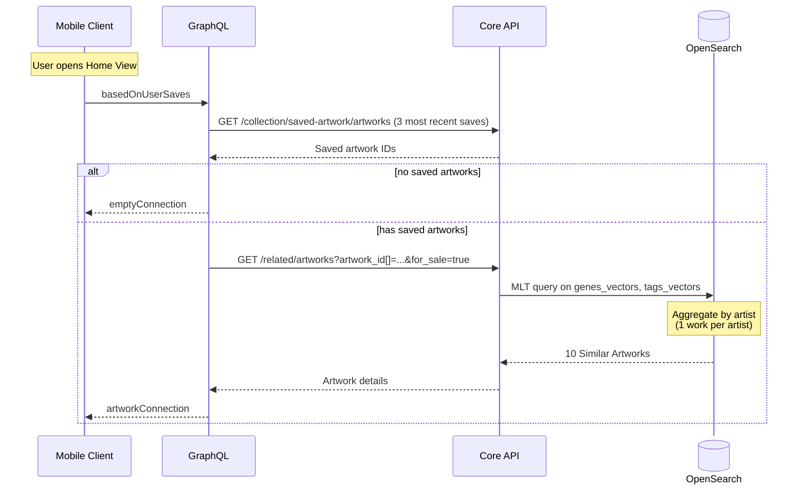

"Inspired By Your Saved Artworks"&mdash;internally known as Based On User Saves&mdash; is a mobile-only recommendations surface for artworks similar to the user's recently saved ones. It uses real-time OpenSearch [More Like This](https://opensearch.org/docs/latest/query-dsl/specialized/more-like-this/) queries&mdash;the same MLT model described in [Discover Daily](./discover-daily.md#mlt-more-like-this-model)&mdash;but with different fields and parameters as shown below.

| MLT Parameter        | Inspired By Your Saved Artworks | Discover Daily                 |
| -------------------- | ------------------------------- | ------------------------------ |
| fields               | genes_vectors, tags_vectors     | genes, materials, tags, medium |
| max_query_terms      | Low for greater efficiency      | High for greater precision     |
| min_doc_freq         | High for greater efficiency     | Low for greater precision      |

The sequence diagram of Inspired By Your Saved Artworks is shown below.

## Algorithm

1. _Eligible User_ := Any.
2. _Saved Artworks_ := _Eligible User_'s $S$ most recent saved artworks.
3. _Career Stage_ := Career Stage Gene value $\in (0–100]$ of the most recent viewed artwork.
4. _Career Stage Range_ := $[\frac{\alpha_{LB}}{100} \times \text{Career Stage}, \beta_{UB}]$ if $\text{Career Stage} \le \beta_{UB}$, else $[\frac{\alpha_{LB}} \times \text{Career Stage}, \gamma_{UB}]$.
5. [if _Saved Artworks_ = 0] _Final Recommendations_ := Empty set (resulting in surface not displayed to _Eligible User_).
6. [if _Saved Artworks_ > 0] _MLT Recommendations By Artist_ := Artworks available for sale, not in _Saved Artworks_, with at least $G$ genes, with _Career Stage_ in _Career Stage Range_, grouped by artists and sorted in descending order by BM25 score.
7. [if _Saved Artworks_ > 0] _Final Recommendations_ := Top artwork from each of the top-$`N`$ _MLT Recommendations By Artist_.

> ⓘ The Career Stage logic prevents showing blue-chip works to users that might be interested in emerging artists, but allows established artist browsers to see the full range above mid-career.
