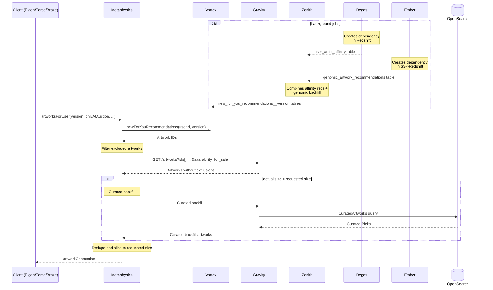
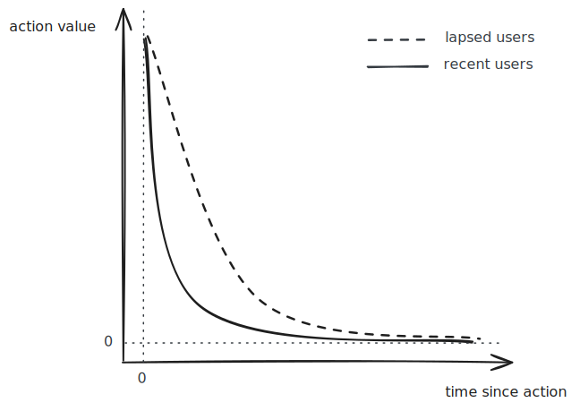
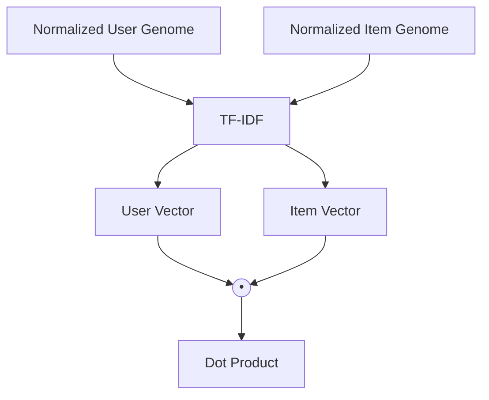

"New Works For You" (NWFY)&mdash;and its close relative "Lots For You"&mdash;is the only recommendations surface with an omni-channel presence. Each channel implements a slightly different version, but all versions use the User Artist Affinity Model to score eligible artworks and recommendations using the Genomic Model as a backfill. Since the user artist affinity model produces a score for an artist, all their artworks inherit the same score, whereas the genomic model produces a score for the artwork.

The sequence diagram of NWFY is shown below.



Before describing the [NWFY algorithms](#algorithms), we need to introduce the scoring models powering them:

- [User Artist Affinity Model](#user-artist-affinity-model)
- [Genomic-based Similarity Model](#genomic-based-similarity-model)

## User Artist Affinity Model

The User Artist Affinity model is designed to quantify a user's preference for an artist by modelling their interactions with them or their artworks. The score enables ranking artists using a simple heuristic that should represent the strength of the relationship between a user and the artists they've interacted with. Using solely this model we cannot recommend artists or artworks of artists the user has never interacted with. For example, if a user interacted with a Warhol, we couldn't recommend a Haring to them. This aspect is the model's biggest limitation and has been overcome in modern recommendation systems.

The model's logic can be broken down into the following steps:

1. The model identifies the set of eligible users for scoring (all active users in the last $M$ months).

2. For each user, a decay factor is assigned based on their recency (days since last session date). This value, which can range from $\lambda_{LB}$ to $\lambda_{UB}$, influences how quickly the value of past actions diminishes over time using the formula

```math
\text{action\_value}(u, a) = \text{action\_count}(u, a) \times 2^{-\frac{\Delta t}{\lambda\alpha}}
```

Where:

- $`\text{action\_count}(u, a) \to \mathbb{Z}`$ is a function returning the number of actions of a certain type relating the artist performed by the user.
- $\Delta t$ is the time elapsed in days since the action.
- $\lambda$ is the decay factor ($\approx$ user recency) $\in [\lambda_{LB}, \lambda_{UB}]$.
- $\alpha$ is a multiplier that varies by action type $\in [\alpha_{LB}, \alpha_{UB}]$.

Recent users receives a smaller decay factor and their past actions lose their value more quickly (see picture below). This has the effect of a short-memory filter resulting in more recent actions having relatively more value than older actions. For lapsed users, a greater decay factor means having more tolerance towards older actions to preserve information.

<picture>
  <source media="(prefers-color-scheme: dark)" srcset="./images/action_time_decay_dark.svg">
  <source media="(prefers-color-scheme: light)" srcset="./images/action_time_decay_light.svg">
  
</picture>

3. The model evaluates various user actions, which are categorized into fixed-score and decayed-score actions:

   - **Fixed-Score Actions**: These are high-intent signals that are assigned a fixed score $s \in \mathbb{R}^+$, with no time decay. They include:
     - Following an artist
     - Having an artwork in their collection
     - Having an alert set for an artist
     - Purchases
   - **Decayed-Score Actions**: The score for these actions is adjusted based on the time decay formula shown above. They include:
     - Browsing actions over the last $3M$ months
     - High-intent and commercial actions (excluding purchases) over the last $3M$ months

4. The scores are then combined:

```math
\begin{align*}
\text{affinity}(u, a) &= \text{browsing\_artist\_value}(u, a)\\
&+ \text{browsing\_artwork\_value}(u, a)\\
&+ \text{inquiry\_value}(u, a)\\
&+ \text{bidding\_value}(u, a)\\
&+ \text{order\_value}(u, a)\\
&+ \text{saved\_artworks\_value}(u, a)\\
&+ s \times \text{purchases}(u, a)\\
&+ s \times \text{follow}(u, a)\\
&+ s \times \text{alert}(u, a)\\
&+ s \times \text{collection}(u, a)
\end{align*}
```

Where:

- $`\text{action\_value}(u, a) \in \mathbb{R}`$ are the time-decayed action values.
- $\text{purchases}(u, a) \in \mathbb{Z}$ is a function returning the number of artworks purchased by the user.
- $\text{follow}(u, a) \in \{0, 1\}$ is an indicator function if the user follows the artist.
- $\text{alert}(u, a) \in \{0, 1\}$ is an indicator function if the user has an alert set for the artist.
- $\text{collection}(u, a) \in \{0, 1\}$ is an indicator function if the user has an artwork in their collection.

## Genomic-based Similarity Model

The genome of an artwork or an artist is a mapping $`\text{genome}(a) = \left\{\left(g_i, v_{i,a}\right) \mid g_i \in \mathcal{G}\right\}`$, where $v_{i,a} \in (0, 100]$ represents how much entity $a$ scores on a gene $g_i$ (e.g., Warhol's genome might be {"1860–1969": 70, "1970–present": 30, ...}).

A genome may be composed of multiple sources with different priority levels.

| Priority | Genome Source |
| -------- | ------------- |
| 3        | Editorial     |
| 2        | Partner       |
| 1        | Automated     |

The genome of a user is inherited from their interactions with artworks and artists. This sounds like epigenetics, but what it really means is that we model a user as an aggregation of the genomes they've engaged with.

Genomes lend themselves to [Bag-of-Words](https://en.wikipedia.org/wiki/Bag-of-words_model) vectorization which enables calculating their geometric similarity in a multidimensional space.



### User Genomes Pre-Processing Algorithm

1. Get the entity genome mappings referring to the following user signals in the last Y years:

   - **Boosted signals**:
     - Added-to-collection Artworks
     - Inquired about Artworks
     - Bid Artworks
     - BNMOed Artworks
   - **Non-Boosted signals**:
     - Saved Artworks
     - Followed Genes (Categories)
     - Followed Artists

2. Consider automated and editorial genes only and merge their mappings into one single genome respecting their priority level.

3. Adjust the score of each gene based on the action type and its recency:

```math
\text{adj\_genome}(a, t) = \left\{g_i: \alpha v_{i,a}e^{-\lambda\Delta t} \mid g_i \in \text{genome}(a)\right\}
```

Where:

- $\alpha \in \mathbb{R}^+$ is a multiplier ($\alpha > 1$ for boosted signals).
- $\Delta t$ is the time elapsed in days since the action.
- $\lambda$ is a fixed decay factor for all users (e.g., a 90-day old action is discounted the same for active and lapsed users).

At this point, a user might have mappings containing duplicate genes. We show an illustrative example below.

```
{
    "user_1" = {
        "my_collection": {
            {gene_1: 10, gene_2: 100}
        },
        "follows": {
            {gene_1: 90, gene_3: 50},
            {gene_2: 80, gene_3: 60}
        },
        ...
    },
    ...
}
```

4. Aggregate genomes by summing the scores of common genes:

```math
\text{genome}(u) = \left\{g_i: \sum_{a,t} v^{\text{adj}}_{i,a,t} \mid g_i \in \bigcup_{a} \text{genome}(a)\right\}
```

Continuing the previous example, we show the result of this operation below.

```
{
    "user_1" = {
        {gene_1: 100, gene_2: 180, gene_3: 110}
    }
}
```

5. Remove unimportant genes (from a curated list) and retain the top $N$ genes by value. Consider users with short genomes as cold-start users.

6. Normalize genome using L2 normalization:

```math
\text{unit\_genome}(u) = \left\{g_i: \frac{v_{i,u}}{\|\mathbf{v}_u\|} \mid g_i \in \text{genome}(u)\right\}
```

7. Pluck the $g_i$'s from the $`\text{unit\_genome}`$ of all users and retain only the genes that appear in at least $U \le |\mathcal{U}|$ user genomes.

### Artwork Genomes Pre-Processing Algorithm

1. Get an artwork genome mappings.

2. Multiply the scores of each gene by $\alpha_E$, $\alpha_A$ and $\alpha_P$ for editorial, automated and partner respectively with $\alpha_E \ge \alpha_A \ge \alpha_P$.

3. Merge genes by $\text{Editorial} \prec \text{Automated} \prec \text{Partner}$ into one single genome mapping.

4. Normalize genome using L2 normalization.

5. Pluck the $g_i$'s from the $`\text{unit\_genome}`$ of all artworks and retain only the genes that appear in at least $A \le |\mathcal{A}|$ artwork genomes.

### Genomes Similarity and Genomic Recommendations

1. Compute the term-frequency for each gene of each user genome and artwork genome:

```math
\text{tf}_{u,g} = \frac{v_{u,g}}{\|\mathbf{v}_u\|}
```

```math
\text{tf}_{a,g} = \frac{v_{a,g}}{\|\mathbf{v}_a\|}
```

2. Compute the inverse-document-frequency for each gene over the combined corpus of users and artworks $\mathcal{C} = \mathcal{U} \cup \mathcal{A}$:

```math
\text{idf}_g = \log{\frac{|\mathcal{C}| + 1}{\text{df}(g, \mathcal{C}) + 1}}
```

Where $\text{df}(g, \mathcal{C})$ returns the number of genomes in $\mathcal{C}$ containing gene $g$.

3. Calculate dot product between TF-IDF vectors of users and artworks:

```math
\text{score}(u, a) = \sum_{g \in \mathcal{G}} \text{TF-IDF}_{u,g} \cdot \text{TF-IDF}_{a,g} = \sum_{g \in \mathcal{G}} \text{tf}_{u,g} \cdot \text{tf}_{a,g} \cdot \text{idf}_g^2
```

Since L2 normalization is applied before IDF weighting, the resulting TF-IDF vectors are not unit vectors, thus the dot product doesn't reduce to a cosine similarity.

The key difference between dot product and cosine similarity is the **magnitude bias**. This means artworks with concentrated signal on rare genes are disproportionately favoured over artworks with broader but weaker coverage across common genes.

5. Post-process and re-rank recommendations:

   - **Artist aggregation**: Limit to $K$ artworks per artist per user, selecting the highest-scoring works.
   - **User aggregation**: For each user, retain the top-$`N`$ scoring artworks.
   - **Exclusion filtering**: Remove artworks already saved by the user.

6. Partition recommendations into fresh, recent and stale based on when the artwork was published.

## Algorithms

### Version C (Web and Mobile)

1. _Eligible Users_ := Active users in the last $M$ months (based on Thursday-Notification send log or platform sessions log).
2. _Unfollowed Artists_ := Artists unfollowed by users in the last $D_1$ days and not currently being followed.
3. _Eligible Artworks_ := 'for sale', 'listed', 'not merch' artworks published in the last $D_2$ days, not deleted, not collected by the user and not from _Unfollowed Artists_
4. _Fresh Recs_ := _Eligible Artworks_ published in the last $D_3$ days with an $\text{affinity}(u, a) \ge \alpha_{H}$.
5. _Affinity Recs_ := _Eligible Artworks_ published more than $D_3$ days ago with an $\text{affinity}(u, a) \ge \alpha_{L}$.
6. _Candidate Recs_ := Union of _Fresh Recs_ and _Affinity Recs_ ensuring no more than $K$ artworks from the same artist (random selection of up to $K$ artworks)
7. _Intra-Artist Ranked Candidate Recs_ := _Candidate Recs_ for the same artist ranked by affinity score (higher first) with a publishing date (recent first) tie breaker.
8. _Genomic Recs_ := Genomic recommendations used as backfill, partitioned into 'fresh', 'recent', and 'stale'.
9. _View Counts_ := View counts for each artwork within the "New Works For You" surface on mobile apps over the last $D_4$ days.
10. _Base P-level_ assignments (the higher the more priority):
    - _Fresh Recs_ $\leftarrow$ P9
    - _Affinity Recs_ $\leftarrow$ P7
    - "Fresh" _Genomic Recs_ $\leftarrow$ P5
    - "Recent" _Genomic Recs_ $\leftarrow$ P3
    - "Stale" _Genomic Recs_ $\leftarrow$ P1
11. _Final P-level_ := _Base P-level_ + _View Counts_ to penalize (push down) already seen artworks.
12. _Final List_ := Union all recommendations, deduplicate by keeping the artwork with the highest _Final P-level_, and sort the final list for each user based on _Final P-level_ with an interleaved-artists tie-breaker mechanism (see example below), take top-$`N`$ entities.

To show how the interleaved-artists tie-breaker mechanism works, imagine we have the following recs after removing duplicates and before sorting.

| Artist | Artwork | Final P-level | Intra-Artist Rank |
| ------ | ------- | ------------- | ----------------- |
| john   | foo     | P9            | 1                 |
| john   | bar     | P7            | 2                 |
| jane   | baz     | P9            | 1                 |
| jane   | qux     | P9            | 2                 |

The _Final List_ would be:

1. foo by john (P9, #1)
2. baz by jane (P9, #1)
3. qux by jane (P9, #2)
4. bar by john (P7, #2)

### Version B (Email)

1. Eligible Users := Logged in users in the last $M_1$ months or users who received a Thursday-Notification email in the last $M_2$ months.
2. Unfollowed Artists := Artists unfollowed in the last $D_1$ days and not currently followed.
3. _Eligible Artworks_ := 'for sale', 'listed', 'not merch' artworks published in the last $D_2$ days, not deleted, not from _Unfollowed Artists_, not already recommended.
4. _Affinity Recs_ := _Eligible Artworks_ with an $\text{affinity}(u, a) \ge \alpha_{L}$, ensuring no more than $K$ artworks from the same artist (random selection of up to $K$ artworks)
5. _Genomic Recs_ := Genomic recommendations used as backfill, partitioned into 'fresh', 'recent', and 'other'.
6. _Base P-level_ assignments:
   - _Affinity Recs_ $\leftarrow$ P4
   - "Fresh" _Genomic Recs_ $\leftarrow$ P3
   - "Recent" _Genomic Recs_ $\leftarrow$ P2
   - "Other" _Genomic Recs_ $\leftarrow$ P1
7. _Final List_ := Union all recommendations, deduplicate by keeping the artwork with the highest _Base P-level_, and sort the final list for each user based on _Base P-level_ with ties resolved using Affinity Score, take top-$`N`$ entities.

### Version A (Experimental)

Same as Version B but uses the same interleaved-artists tie-breaker mechanism as version C.
