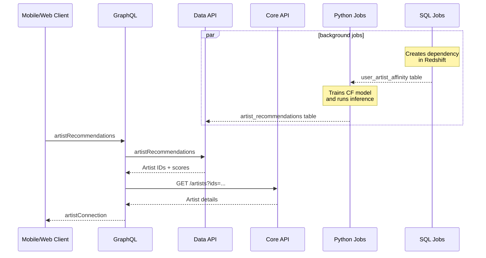

"Recommended Artists" is a personalized artist recommendations surface across web and mobile featuring recommendations from a collaborative filtering model that uses Machine Learning to predict a user's preference score for an artist using the user-artist interaction matrix. Unlike [We Think You'll Love](./we-think-youll-love.md), this model does not use auxiliary features, relying purely on the collaborative signal between users and artists.

The sequence diagram of Recommended Artists is shown below.

The scoring model used by "Recommended Artists" is nearly identical to [Artwork Hybrid Filtering Model](./we-think-youll-love.md#hybrid-collaborative-filtering-model). The main differences are:
- it uses the artist-item feedback matrix instead of a user-item one,
- it's a pure collaborative filtering model&mdash;the user and item feature matrices reduce to:

$$\tilde{\mathbf{X}}_u = \mathbf{I}_{n_u}, \quad \tilde{\mathbf{X}}_i = \mathbf{I}_{n_i}$$

As a result, the training algorithm of the scoring model is simply:

1. _Active Users_ := Users with a session in the last $D_a$ days.
2. _Eligible Artists_ := Artists with:
   - At least $A$ artworks for sale;
   - An artwork published in the last $D_p$ days;
   - Engagement or commercial actions from at least $U$ users active in the last $M$ months;
   - A total [user-artist affinity score](./new-works-for-you.md#user-artist-affinity-model) across all users active in the last $M$ months of at least $S_g$ and with one _Active Users_ of at least $S_u$.
3. _Weighted Interaction Data_ := Tuples $(u, i, w)$ for all _Active Users_ and _Eligible Artists_, where $w$ is the user-artist affinity score capped at $w_{UB}$.
4. _ML Model_ := Use _Weighted Interaction Data_ to optimize the model parameters ($k$-dim user and artist embeddings, and biases) using stochastic gradient descent on a $w$-weighted WARP loss with a max of $M$ trials, and Adagrad optimizer with a learning rate of $\alpha$ for $T$ epochs.

## Algorithm

1. _Eligible User_ := User in _Weighted Interaction Data_.
2. _Eligible Artists_ := Artists in _Weighted Interaction Data_, excluding _Eligible User_'s artists used for training _ML Model_.
3. _CF Recommendations_ := _Eligible Artists_ sorted by predicted scores (user-artist similarity) from _ML Model_.
4. _Artist Recommendations_ := Top-$`N`$ _CF Recommendations_.
