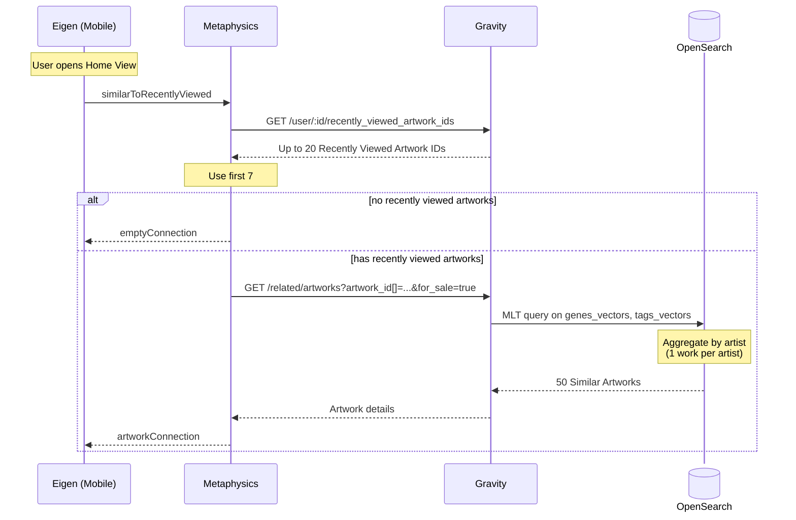

"Similar To Works You've Viewed"&mdash;internally known as Similar To Recently Viewed&mdash; is a mobile-only recommendations surface for artworks similar to the user's 7 most recently viewed ones. It uses OpenSearch [More Like This](https://opensearch.org/docs/latest/query-dsl/specialized/more-like-this/) queries&mdash;the same MLT model described in [Discover Daily](./discover-daily.md#mlt-more-like-this-model)&mdash;but with different fields and parameters.

| MLT Parameter        | Similar To Works You've Viewed | Discover Daily                 |
| -------------------- | ------------------------------ | ------------------------------ |
| fields               | genes_vectors, tags_vectors    | genes, materials, tags, medium |
| min_term_freq        | 1                              | 1                              |
| max_query_terms      | 18                             | 25 (default)                   |
| min_doc_freq         | 200                            | 1                              |
| minimum_should_match | 30%                            | 30% (default)                  |

## Algorithm

1. _Saved Artworks_ := User's 7 most recent viewed artworks.
2. _Career Stage_ := Career Stage Gene value (0–100) of the most recent viewed artwork.
3. _Career Stage Range_ := $[0.7 \times \text{Career Stage}, 70]$ if $\text{Career Stage} \le 70$, else $[0.7 \times \text{Career Stage}, 100]$.
4. [if _Saved Artworks_ = 0] _Final Recommendations_ := Empty connection.
5. [if _Saved Artworks_ > 0] _MLT Recommendations By Artist_ := Artworks available for sale, not in _Saved Artworks_, with at least 6 genes, with Career Stage gene in _Career Stage Range_, grouped by artists and sorted in descending order by BM25 score.
6. [if _Saved Artworks_ > 0] _Final Recommendations_ := Top artwork from each of the top-50 _MLT Recommendations By Artist_.

> ⓘ The Career Stage logic prevents showing blue-chip works to users that might be interested in emerging artists, but allows established artist browsers to see the full range above mid-career.
