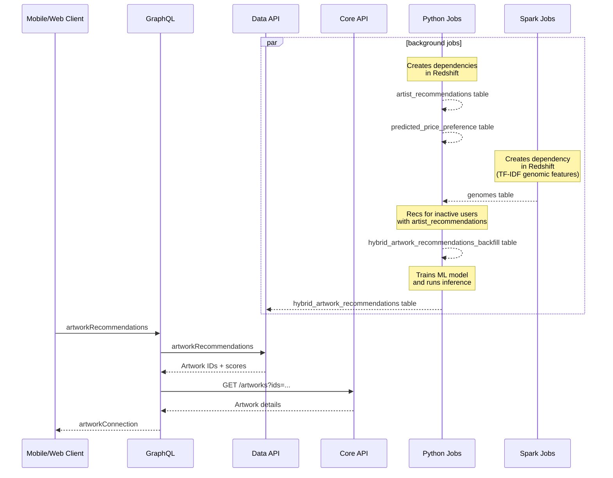
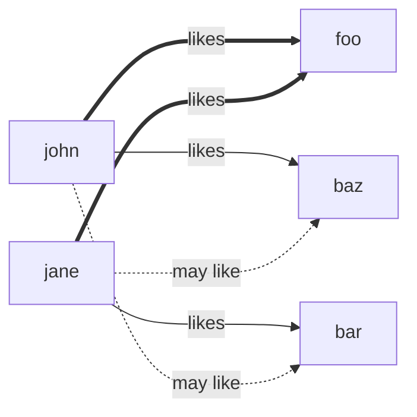

"We Think You'll Love" (WTYL) is a personalized artwork recommendations surface across web and mobile featuring recommendations from a hybrid collaborative filtering model that uses Machine Learning to predict a user's preference score for an artwork using the user-item interaction matrix as well as user and item auxiliary features (e.g., genes). Although a hybrid model is often used to mitigate the cold-start problem, we use it to only recommend items and to make recommendations to users included in the training data. Users not in the training due to recency eligibility criteria receive [Artist Collaborative Filtering Recommendations](./recommended-artists.md).

The sequence diagram of WTYL is shown below.

Before describing the [algorithm](#algorithm), we introduce the scoring model powering it:

- [Artwork Hybrid Filtering Model](#hybrid-collaborative-filtering-model)

## Artwork Hybrid Filtering Model

The Artwork Hybrid Filtering model combines [Collaborative Filtering](https://en.wikipedia.org/wiki/Collaborative_filtering) (learning preferences from a global user-item feedback matrix) with content-based features. This hybrid approach addresses the cold-start problem where pure Collaborative Filtering struggles with new users or items that have few interactions.

What makes this model different to the others in Artsy's ecosystem is the use of the collaboration between users as shown in the bipartite graph below.

If John and Jane like the same items, then they may enjoy each other's items. Although true in principle, this is an oversimplification&mdash;merely using co-occurrences would lead to an explosion of candidates as transitive connections multiply across the network.

To overcome these limitations we use representation learning techniques such as Matrix Factorization&mdash;more specifically LightFM (Kula, 2015)&mdash;to compress these relationships into a low-dimensional latent space, forcing the model to learn meaningful patterns rather than propagating every connection.

### LightFM Model

LightFM is a learning-to-rank model that combines collaborative filtering with content-based features. It learns latent representations for users and items by combining their ID embeddings with auxiliary features (e.g., genes). The model is trained using a pairwise ranking loss, which optimizes for top-of-list accuracy.

> :nerd_face: Deep Dive Ahead! This section gets into the mathematical weeds. If you’re here for the pseudo-code, feel free to jump to the [training algorithm](#training-algorithm). Due to how different browsers handle $\LaTeX$ fonts, this section looks best in Firefox or Safari.

| Symbol                                                                                                  | Definition                                      |
|---------------------------------------------------------------------------------------------------------|-------------------------------------------------|
| $`\mathcal{U} = \{1, \ldots, n_u\}`$                                                                    | Set of users                                    |
| $`\mathcal{I} = \{1, \ldots, n_i\}`$                                                                    | Set of items                                    |
| $\mathcal{S}^+ \subset \mathcal{U} \times \mathcal{I}$                                                  | Positive interactions                           |
| $w: \mathcal{S}^+ \to \mathbb{R}^+$                                                                     | Interaction weight function                     |
| $d_u$                                                                                                   | Number of auxiliary user features (e.g., genes) |
| $d_i$                                                                                                   | Number of auxiliary item features (e.g., genes) |
| $k$                                                                                                     | Number of latent dimensions                     |
| $`\tilde{\mathbf{X}}_u = [\mathbf{I}_{n_u} \mid \mathbf{X}_u] \in \mathbb{R}^{n_u \times (n_u + d_u)}`$ | User feature matrix                             |
| $`\tilde{\mathbf{X}}_i = [\mathbf{I}_{n_i} \mid \mathbf{X}_i] \in \mathbb{R}^{n_i \times (n_i + d_i)}`$ | Item feature matrix                             |
| $\mathbf{E}_u \in \mathbb{R}^{(n_u + d_u) \times k}$                                                    | User feature embeddings                         |
| $\mathbf{E}_i \in \mathbb{R}^{(n_i + d_i) \times k}$                                                    | Item feature embeddings                         |
| $\mathbf{b}_u \in \mathbb{R}^{n_u + d_u}$                                                               | User feature biases                             |
| $\mathbf{b}_i \in \mathbb{R}^{n_i + d_i}$                                                               | Item feature biases                             |

LightFM makes predictions as:

$$\hat{y}_{ui} = \langle \mathbf{p}_u, \mathbf{q}_i \rangle + \beta_u + \beta_i$$

where:

- $\mathbf{p}_u = \tilde{\mathbf{x}}_u^\top \mathbf{E}_u \in \mathbb{R}^k$ is the latent representation for a user.
- $\beta_u = \tilde{\mathbf{x}}_u^\top \mathbf{b}_u \in \mathbb{R}$ is the user's baseline rating tendency&mdash;the score they would give an "average" item.
- $\mathbf{q}_i = \tilde{\mathbf{x}}_i^\top \mathbf{E}_i \in \mathbb{R}^k$ is the latent representation for an item.
- $\beta_i = \tilde{\mathbf{x}}_i^\top \mathbf{b}_i \in \mathbb{R}$ is the item's baseline popularity&mdash;the score they receive on "average".

The trainable parameters are $\mathbf{E}_u$, $\mathbf{b}_u$, $\mathbf{E}_i$, $\mathbf{b}_i$. These are learned via **stochastic** gradient descent on the WARP loss, which optimizes for ranking quality by penalizing violations where a negative item scores within a margin of a positive item.

Formally, the WARP loss for each training pair $(u, i^+) \in \mathcal{S}^+$ is calculated as:

$$L_{ui^+} = w(u, i^+) \cdot \log\left(\max\left(1, \left\lfloor \frac{n_i - 1}{N} \right\rfloor\right)\right)$$

where $\lfloor(n_i - 1)/N\rfloor$ is a (biased) approximation of the rank of $i^+$. $N$ is obtained through sampling negatives $i^- \sim \text{Uniform}(\mathcal{I} \setminus i : (u, i) \in \mathcal{S}^+)$ until finding a margin violation:

$$\hat{y}_{ui^-} > \hat{y}_{ui^+} - 1$$

If no violation is found within a maximum number of trials, $i^+$ is well-ranked and the model parameters are not updated.

As long as the value of a feature $f$ in a feature matrix $\tilde{x}$ is non zero, the parameter corresponding to such feature is updated as:

1. Calculate gradients:

$$\nabla^{+}_{\mathbf{E}_{i[f,j]}} = L_{ui^+} \cdot \frac{\partial \hat{y}_{u,i^+}}{\partial \mathbf{E}_{i[f,j]}} = L_{ui^+} \cdot \mathbf{p}_{u[j]} \cdot \tilde{\mathbf{x}}_{i^+[f]}$$
$$\nabla^{-}_{\mathbf{E}_{i[f,j]}} = L_{ui^+} \cdot \frac{\partial \hat{y}_{u,i^-}}{\partial \mathbf{E}_{i[f,j]}} = L_{ui^+} \cdot \mathbf{p}_{u[j]} \cdot \tilde{\mathbf{x}}_{i^-[f]}$$
$$\nabla^{+}_{\mathbf{E}_{u[f,j]}} = L_{ui^+} \cdot \frac{\partial \hat{y}_{u,i^+}}{\partial \mathbf{E}_{u[f,j]}} = L_{ui^+} \cdot \mathbf{q}_{i^+[j]} \cdot \tilde{\mathbf{x}}_{u[f]}$$
$$\nabla^{-}_{\mathbf{E}_{u[f,j]}} = L_{ui^+} \cdot \frac{\partial \hat{y}_{u,i^-}}{\partial \mathbf{E}_{u[f,j]}} = L_{ui^+} \cdot \mathbf{q}_{i^-[j]} \cdot \tilde{\mathbf{x}}_{u[f]}$$
$$\nabla^{+}_{\mathbf{b}_{i[f]}} = L_{ui^+} \cdot \tilde{\mathbf{x}}_{i^+[f]}$$
$$\nabla^{-}_{\mathbf{b}_{i[f]}} = L_{ui^+} \cdot \tilde{\mathbf{x}}_{i^-[f]}$$
$$\nabla_{\mathbf{b}_{u[f]}} = L_{ui^+} \cdot \tilde{\mathbf{x}}_{u[f]}$$

2. Perform gradient ascent for $`\hat{y}_{ui^+}`$ and descent for $`\hat{y}_{ui^-}`$:

$$\mathbf{E}_{i[f,j]} \gets \mathbf{E}_{i[f,j]} + \eta^{(t)}_f \cdot \nabla^{+}_{\mathbf{E}_{i[f,j]}} - \eta^{(t)}_f \cdot \nabla^{-}_{\mathbf{E}_{i[f,j]}}$$
$$\mathbf{E}_{u[f,j]} \gets \mathbf{E}_{u[f,j]} + \eta^{(t)}_f \cdot \nabla^{+}_{\mathbf{E}_{u[f,j]}} - \eta^{(t)}_f \cdot \nabla^{-}_{\mathbf{E}_{u[f,j]}}$$
$$\mathbf{b}_{i[f]} \gets \mathbf{b}_{i[f]} + \eta^{(t)}_f \cdot \nabla^{+}_{\mathbf{b}_{i[f]}} - \eta^{(t)}_f \cdot \nabla^{-}_{\mathbf{b}_{i[f]}}$$
$$\mathbf{b}_{u[f]} \gets \mathbf{b}_{u[f]} - \eta^{(t)}_f \cdot \nabla_{\mathbf{b}_{u[f]}}$$

where $\eta^{(t)}_f$ is a feature-specific learning rate at epoch $t$ scheduled via the Adagrad optimizer.

#### Training Algorithm

1. _Active Users_ := Users with a session in the last $D_a$ days.
2. _Active Artworks_ := Artworks of value less than $`\$P`$ published in the last $D_p$ days engaged with by at least one _Active Users_.
3. _Active Interactions_ := Tuples $`(u, i, j, w_j)`$ for all _Active Users_ and _Training Artworks_ with a weight $(w_j)$ for each type of interaction $(j)$:

| Interaction Type                  | Weight                                                      |
| --------------------------------- | ----------------------------------------------------------- |
| Artwork views last $D_i$ days     | $`\text{view\_count}(u, i) \times 2^{-\Delta t / \lambda}`$ |
| Artwork purchases                 | $w_p$                                                       |
| Artwork inquiries last $D_i$ days | $w_q$                                                       |
| Artwork bids last $D_i$ days      | $w_b$                                                       |
| Artwork saves last $D_i$ days     | $w_s$                                                       |
| In-collection artworks            | $w_c$                                                       |

Where:

- $`\text{view\_count}(u, i) \to \mathbb{Z}`$ is a function returning the number of distinct sessions user $u$ landed on artwork $i$'s page.
- $\Delta t$ is the time elapsed in days since the view.
- $\lambda > 0$ controls the half-life (larger = slower decay) for all users (e.g., a 90-day old action is discounted the same for active and lapsed users).

4. _Following Users_ := Users with a session in the last $D_f$ days with at least a followed artist.
5. _Followed Artworks_ : Artworks available for sale published in the last $D_p$ days, by artists that received a follow by _Following Users_ in the last $D_w$ days.
6. _Follows Interactions_ := Tuples $`(u, i, \_, w_j)`$ for all _Following Users_ and _Followed Artworks_ with a fixed rating $w_j=w_f$.
7. _Interactions_ := The union of _Active Interactions_ and _Follows Interactions_.
8. _Weighted Interaction Data_ := A set of aggregated tuples $`\left\{(u, i, \bar{w}_{ui}) \mid \bar{w}_{ui} > w_{LB}\right\}`$ where $`\bar{w}_{ui} = \min{\left\{w_{UB}, \sum_{j \in \mathcal{I}_{ui}} w_j \right\}}`$ and $\mathcal{I}_{ui}$ is the subset of _Interactions_ of user $u$ with artwork $i$.
9. _Features Data_ := Collect the following features for users and artworks in _Weighted Interaction Data_:

| Feature                                                                               | Entity             | Example                                          |
|---------------------------------------------------------------------------------------|--------------------|--------------------------------------------------|
| [TF-IDF genomic features](new-works-for-you.md#user-genomes-pre-processing-algorithm) | Users and Artworks | {"feature_name": "zoomorphism", value: 0.5}      |
| Medium type features                                                                  | Artworks           | {"feature_name": "print", value: True}           |
| Edition type features                                                                 | Artworks           | {"feature_name": "limited edition", value: True} |

10. _ML Model_ := Use _Weighted Interaction Data_ and _Features Data_ to optimize the model parameters of a [LightFM model](#lightfm-model) ($k$-dim user and item embeddings, and biases) using stochastic gradient descent on a $\bar{w}$-weighted WARP loss with a max of $M$ trials, and Adagrad optimizer with a learning rate of $\alpha$ for $T$ epochs.

## Algorithm

1. _Eligible User_ := User in _Weighted Interaction Data_ (see [training algorithm](#training-algorithm)).
2. _Backfill-eligible User_ := Not _Eligible User_ with a session in the last $D_b$ days.
3. _Eligible Artworks_ := Artworks in _Weighted Interaction Data_, available for sale, with at least one image, and visible price, excluding _Eligible User_'s artworks used for training _ML Model_.
4. _Purchase Price Prediction_ := _Eligible User_'s or _Backfill-eligible User_'s predicted purchase price[^1], if available, else $0.
5. _Price Range Preference_ := Discretized _Purchase Price Prediction_ to range $`[\$P^i_{LB}, \$P^i_{UB}]`$ where $`i \in \{1, 2, 3, 4, 5\}`$, where $P^1_{LB}=0$.
6. _Affordable Artworks_ := _Eligible Artworks_ in _Price Range Preference_ with some over-budget headroom.
7. [if _Affordable Artworks_ = 0] _Final Recommendations_ := Empty set (resulting in surface not displayed to _Eligible User_).
8. [if _Affordable Artworks_ > 0] _Hybrid Recommendations_ := _Affordable Artworks_ sorted by predicted scores (user-item similarity) from _ML Model_ (see [training algorithm](#training-algorithm)).
9. [if _Affordable Artworks_ > 0] _View Counts_ := View counts on mobile for each artwork in _Hybrid Recommendations_ over the last $D$ days.
10. [if _Affordable Artworks_ > 0] _Freshness Re-ranked Recommendations_ := _Hybrid Recommendations_ sorted by _View Counts_ (including 0, that is unseen artworks first).
11. [if _Backfill-eligible User_] _Artists Recommendations_ := Artworks available for sale, published in the last $D_p$ days, within $`\$P`$ from _Purchase Price Prediction_, and from recommended artists using [Artist Collaborative Filtering Recommendations](./recommended-artists.md).
12. - [if _Affordable Artworks_ > 0] _Intra-Artist Re-ranked Recommendations_ := Top-$`K`$ artworks of a single artist in _Freshness Re-ranked Recommendations_, sorted using a freshness-first intra-artist ranking to promote (not guarantee) the interleaving of artworks from an artist with artworks from other artists (see example below).
    - [if _Backfill-eligible User_] _Intra-Artist Re-ranked Recommendations_ := Top-$`K`$ artworks of a single artist in _Artists Recommendations_, sorted using an intra-artist ranking based on the user-artist similarity score.
13. [if _Backfill-eligible User_ or _Affordable Artworks_ > 0] _WTYL Recommendations_ := Top-$`N`$ _Intra-Artist Re-ranked Recommendations_.

Example of freshness-first intra-artist ranking.

| Artist | Artwork | View Counts | Similarity Score | Intra-Artist Rank |
| ------ | ------- | ----------- | ---------------- | ----------------- |
| john   | foo     | 0           | 0.8              | 1                 |
| john   | bar     | 3           | 0.9              | 2                 |
| jane   | baz     | 0           | 0.5              | 1                 |
| jane   | qux     | 0           | 0.3              | 2                 |

The _Intra-Artist Re-ranked Recommendations_ would be:

1. foo by john (0, 0.8, #1)
2. baz by jane (0, 0.5, #1)
3. qux by jane (0, 0.3, #2)
4. bar by john (3, 0.9, #2)

[^1]: Purchase price predictions are produced by a regression model f̂(X) ≈ 𝔼[Y ∣ X], where Y ∈ ℝ is an observed purchase price and X ∈ ℝᵈ are attitudinal (e.g., stated budget) and behavioural features (e.g., interactions with artworks). The model is trained on purchasers but generalizes inductively also to non-purchasers exhibiting similar behaviours.

## References

Kula, M. (2015). Metadata Embeddings for User and Item Cold-start Recommendations. ArXiv, [abs/1507.08439](https://arxiv.org/abs/1507.08439).
